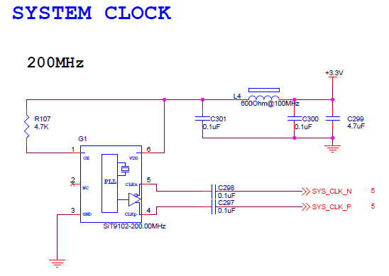
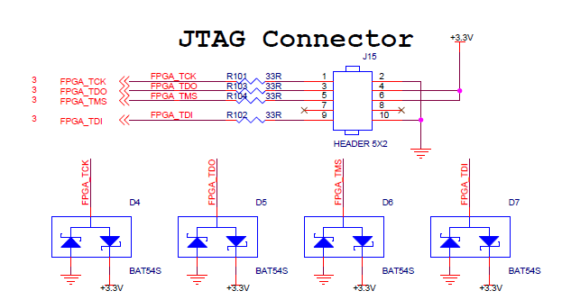
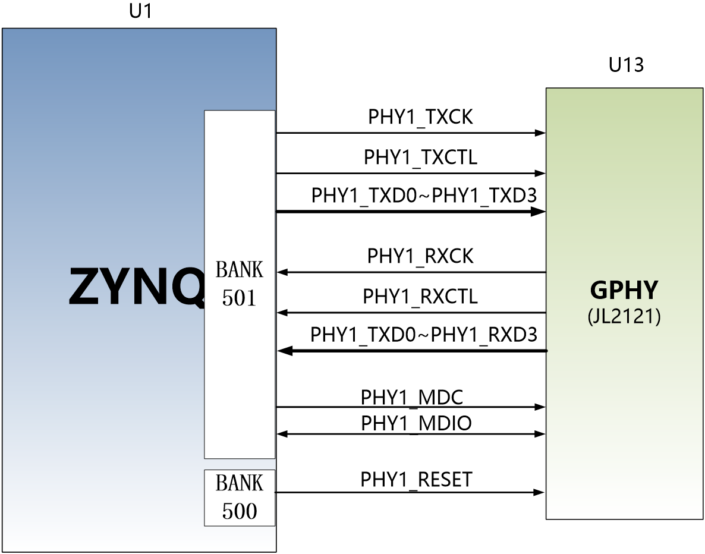

 芯驿电子科技（上海）有限公司 基于XILINX
ZYNQ7000开发平台的开发板（型号：AX7Z100B）2019款正式发布了正式发布了，为了让您对此开发平台可以快速了解，我们编写了此用户手册。

这款ZYNQ7000
FPGA开发平台采用核心板加扩展板的模式，方便用户对核心板的二次开发利用。核心板使用XILINX的Zynq7000
SOC芯片XC7Z100的解决方案，它采用ARM+FPGA SOC技术将双核ARM Cortex-A9
和FPGA 可编程逻辑集成在一颗芯片上。另外核心板上含有4片共2GB高速DDR3
SDRAM芯片，1片8GB的eMMC存储芯片和2片256Mb的QSPI FLASH芯片。

在底板设计上我们为用户扩展了丰富的外围接口，比如1个PCIex8
接口、4路光纤接口、2路千兆以太网接口、4路USB2.0
HOST接口、1路HDMI输出接口、1路HDMI输入接口、1路UART串口接口、1路SD卡接口、1个40针扩展接口等等。满足用户各种高速数据交换，数据存储，视频传输处理以及工业控制的要求，是一款"专业级“的ZYNQ开发平台。为高速数据传输和交换，数据处理的前期验证和后期应用提供了可能。相信这样的一款产品非常适合从事ZYNQ开发的学生、工程师等群体。

.. image:: images/media/image2.jpeg
   :width: 6.76736in
   :height: 3.83472in

开发板简介
==========

在这里，对这款AX7Z100B ZYNQ开发平台进行简单的功能介绍。

开发板的整个结构，继承了我们一贯的核心板+扩展板的模式来设计的。核心板和扩展板之间使用高速板间连接器连接。

核心板主要由ZYNQ7100 + 4个DDR3 + eMMC + QSPI
FLASH的最小系统构成。ZYNQ7100采用Xilinx公司的Zynq7000系列的芯片，型号为XC7Z100-2FFG900。ZYNQ7100芯片可分成处理器系统部分Processor
System（PS）和可编程逻辑部分Programmable
Logic（PL）。在ZYNQ7100芯片的PS端和PL端分别挂了2片DDR3，每片DDR3容量高达512M字节，使得ARM系统和FPGA系统能独立处理和存储的数据的功能。PS端的8GB
eMMC FLASH存储芯片和512Mb的QSPI
FLASH用来静态存储ZYNQ的操作系统、文件系统及用户数据。

底板为核心板扩展了丰富的外围接口，其中包含1个PCIex8接口、4路光纤接口、2路千兆以太网接口（PS和PL各一路）、4路USB2.0
HOST接口、1路HDMI输出接口、1路HDMI输出接口、1路UART串口接口、1路SD卡接口、1个40针扩展接口和一些按键LED。

下图为整个开发系统的结构示意图：

通过这个示意图，我们可以看到，我们这个开发平台所能含有的接口和功能。

-   ZYNQ7100核心板

由XC7Z100+2GB DDR3+8GB eMMC FLASH + 512Mb QSPI
FLASH组成，另外有三个晶振提供时钟，一个单端33.3333MHz晶振提供给PS系统，一个差分200MHz晶振提供给PL逻辑DDR参考时钟，另外一个差分125MHz晶振提供给GTX收发器参考时钟。

-  PCIe x8接口

支持PCI Express 2.0标准，提供标准的PCIe
x8高速数据传输接口，单通道通信速率可高达5GBaud。

-  4路SFP光纤接口

ZYNQ的GTX收发器的4路高速收发器连接到4个光模块的发送和接收，实现4路高速的光纤通信接口。每路的光纤数据通信接收和发送的速度高达10Gb/s。

-  千兆以太网接口

2路10/100M/1000M以太网RJ45接口，用于和电脑或其它网络设备进行以太网数据交换。网络接口芯片采用景略半导体的JL2121工业级GPHY芯片，1路以太网连接到ZYNQ芯片的PS端，1路以太网连接到ZYNQ芯片的PL端。

-  HDMI视频输出

1路HDMI视频输出接口，我们选用了ANALOG DEVICE公司的ADV7511
HDMI编码芯片，最高支持1080P@60Hz输出，支持3D输出。

-  HDMI视频输入

1路HDMI视频输入接口，我们选用了Silion Image公司的SIL9011/SIL9013
HDMI解码芯片，最高支持1080P@60Hz输入，支持不同格式的数据输入。

-  USB2.0 HOST接口

通过USB Hub芯片扩展4路USB
HOST接口，用于连接外部的USB从设备，比如连接鼠标，键盘，U盘等等。USB接口采用扁型USB接口(USB
Type A)。

-  USB Uart接口

1路Uart转USB接口，用于和电脑通信，方便用户调试。串口芯片采用Silicon Labs
CP2102GM的USB-UAR芯片, USB接口采用MINI USB接口。

-  Micro SD卡座

1路Micro SD卡座，用于存储操作系统镜像和文件系统。

-  40针扩展口

1个40针2.54mm间距的扩展口，可以外接黑金的各种模块（双目摄像头，TFT
LCD屏，高速AD模块等等）。扩展口包含5V电源1路，3.3V电源2路，地3路，IO口34路。

-  JTAG调试口

1个10针2.54mm标准的JTAG口，用于FPGA程序的下载和调试，用户可以通过XILINX下载器对ZYNQ系统进行调试和下载。

-  LED灯

9个发光二极管LED,
核心板上2个，底板上7个。核心板上1个电源指示灯；1个DONE配置指示灯。底板上有1个电源指示灯，4个用户指示灯和2个串口指示灯。

-  按键

5个按键，1个复位按键， 4个PL用户按键。

AC7Z100C核心板
==============

简介
----

AC7Z100C(**核心板型号，下同**)核心板，ZYNQ芯片是基于XILINX公司的ZYNQ7000系列的XC7Z100-2FFG900。ZYNQ芯片的PS系统集成了两个ARM
Cortex™-A9处理器，AMBA®互连，内部存储器，外部存储器接口和外设。ZYNQ芯片的FPGA内部含有丰富的可编程逻辑单元，DSP和内部RAM。

   这款核心板使用了4片Micron的512MB的DDR3芯片MT41J256M16HA-125,总的容量达2GB。其中PS和PL端各挂载两片，分别组成32bit的总线宽度。PS端的DDR3
   SDRAM的最高运行速度可达533MHz(数据速率1066Mbps)，PL端的DDR3
   SDRAM的最高运行速度可达800MHz(数据速率1600Mbps)。另外核心板上也集成了2片256MBit大小的QSPI
   FLASH和8GB大小的eMMC FLASH芯片，用于启动存储配置和系统文件。

   为了和底板连接，这款核心板的4个板对板连接器扩展出了PS端的USB接口，千兆以太网接口，SD卡接口及其它剩余的MIO口；也扩展出了ZYNQ的16对高速收发器GTX接口；以及PL端的几乎所有IO口（140个3.3V
   IO和48个1.8V
   IO），其中BANK10,BANK11,BANK12的IO的电平可以通过更换核心板上的LDO芯片来修改，满足用户不用电平接口的要求。对于需要大量IO的用户，此核心板将是不错的选择。而且IO连接部分，ZYNQ芯片到接口之间走线做了等长和差分处理，并且核心板尺寸仅为80*60（mm），对于二次开发来说，非常适合。

.. image:: images/media/image4.png
   :width: 4.61944in
   :height: 3.47292in

AC7Z100C核心板正面图

AC7Z100C核心板背面图

ZYNQ芯片
--------

核心板使用的是Xilinx公司的Zynq7000系列的芯片，型号为XC7Z100-2FFG900。芯片的PS系统集成了两个ARM
Cortex™-A9处理器，AMBA®互连，内部存储器，外部存储器接口和外设。这些外设主要包括USB总线接口，以太网接口，SD/SDIO接口，I2C总线接口，CAN总线接口，UART接口，GPIO等。PS可以独立运行并在上电或复位下启动。ZYNQ7000芯片的总体框图如图2-2-1所示

.. image:: images/media/image6.png
   :width: 6.02222in
   :height: 3.46458in

图2-2-1 ZYNQ7000芯片的总体框图

其中PS系统部分的主要参数如下：

-  基于ARM 双核CortexA9 的应用处理器，ARM-v7架构 高达800MHz

-  每个CPU 32KB 1级指令和数据缓存，512KB 2级缓存 2个CPU共享

-  片上boot ROM和256KB 片内RAM

-  外部存储接口，支持16/32 bit DDR2、DDR3接口

-  两个千兆网卡支持：发散-聚集DMA ，GMII，RGMII，SGMII接口

-  两个USB2.0 OTG接口，每个最多支持12节点

-  两个CAN2.0B总线接口

-  两个SD卡、SDIO、MMC兼容控制器

-  2个SPI，2个UARTs，2个I2C接口

-  54个多功能配置的IO，可以软件配置成普通IO或者外设控制接口

-  PS内和PS到PL的高带宽连接

其中PL逻辑部分的主要参数如下：

-  逻辑单元Logic Cells：444K；

-  查找表LUTs: 277400

-  触发器(flip-flops):554,800

-  乘法器18x25MACCs：2020;

-  Block RAM：26.5Mb；

-  16路高速GTX收发器，支持PCIE Gen2x8；

-  2个AD转换器,可以测量片上电压、温度感应和高达17外部差分输入通道，1MBPS

XC7Z100-2FFG900I芯片的速度等级为-2，工业级，封装为FGG900，引脚间距为1.0mm，ZYNQ7000系列的具体的芯片型号定义如下图2-2所示。

.. image:: images/media/image7.png
   :width: 6.13194in
   :height: 2.57361in

图2-2-2 ZYNQ型号命名规则定义

图2-2-3为核心板所用的XC7Z100芯片实物图。

图2-3 XC7Z100芯片实物

DDR3 DRAM
---------

AX7Z100B核心板上配有四片Micron(美光）的512MB的DDR3芯片,型号为MT41J256M16HA-125(兼容MT41K256M16HA-125)，其中PS和PL端各挂载两片。两片DDR3
SDRAM组成32bit的总线宽度。PS端的DDR3
SDRAM的最高运行速度可达533MHz(数据速率1066Mbps)，两片DDR3存储系统直接连接到了ZYNQ处理系统（PS）的BANK
502的存储器接口上。PL端的DDR3
SDRAM的最高运行速度可达800MHz(数据速率1600Mbps)，两片DDR3存储系统连接到了FPGA的BANK33,
BANK34的接口上。DDR3 SDRAM的具体配置如下表2-3-1所示。

表2-3-1 DDR3 SDRAM配置

+--------------+---------------------+------------------+--------------+
| **位号**     | **芯片型号**        | **容量**         | **厂家**     |
+--------------+---------------------+------------------+--------------+
| U4,U5,U7,U8  | MT41J256M16HA-125   | 256M x 16bit     | Micron       |
+--------------+---------------------+------------------+--------------+

DDR3的硬件设计需要严格考虑信号完整性，我们在电路设计和PCB设计的时候已经充分考虑了匹配电阻/终端电阻,走线阻抗控制，走线等长控制，　保证DDR3的高速稳定的工作。

PS端的DDR3 DRAM的硬件连接方式如图2-3-1所示:

图2-3-1 PS端DDR3 DRAM原理图部分

PL端的DDR3 DRAM的硬件连接方式如图2-3-2所示:

图2-3-2 PL端DDR3 DRAM原理图部分

**PS端DDR3 DRAM引脚分配：**

+-----------------------+---------------------+------------------------+
| **信号名称**          | **ZYNQ引脚名**      | **ZYNQ引脚号**         |
+-----------------------+---------------------+------------------------+
| **PS_DDR3_DQS0_P**    | PS_DDR_DQS_P0_502   | C26                    |
+-----------------------+---------------------+------------------------+
| **PS_DDR3_DQS0_N**    | PS_DDR_DQS_N0_502   | B26                    |
+-----------------------+---------------------+------------------------+
| **PS_DDR3_DQS1_P**    | PS_DDR_DQS_P1_502   | C29                    |
+-----------------------+---------------------+------------------------+
| **PS_DDR3_DQS1_N**    | PS_DDR_DQS_N1_502   | B29                    |
+-----------------------+---------------------+------------------------+
| **PS_DDR3_DQS2_P**    | PS_DDR_DQS_P2_502   | G29                    |
+-----------------------+---------------------+------------------------+
| **PS_DDR3_DQS2_N**    | PS_DDR_DQS_N2_502   | F29                    |
+-----------------------+---------------------+------------------------+
| **PS_DDR3_DQS3_P**    | PS_DDR_DQS_P3_502   | L28                    |
+-----------------------+---------------------+------------------------+
| **PS_DDR3_DQS4_N**    | PS_DDR_DQS_N3_502   | L29                    |
+-----------------------+---------------------+------------------------+
| **PS_DDR3_D0**        | PS_DDR_DQ0_502      | A25                    |
+-----------------------+---------------------+------------------------+
| **PS_DDR3_D1**        | PS_DDR_DQ1_502      | E25                    |
+-----------------------+---------------------+------------------------+
| **PS_DDR3_D2**        | PS_DDR_DQ2_502      | B27                    |
+-----------------------+---------------------+------------------------+
| **PS_DDR3_D3**        | PS_DDR_DQ3_502      | D25                    |
+-----------------------+---------------------+------------------------+
| **PS_DDR3_D4**        | PS_DDR_DQ4_502      | B25                    |
+-----------------------+---------------------+------------------------+
| **PS_DDR3_D5**        | PS_DDR_DQ5_502      | E26                    |
+-----------------------+---------------------+------------------------+
| **PS_DDR3_D6**        | PS_DDR_DQ6_502      | D26                    |
+-----------------------+---------------------+------------------------+
| **PS_DDR3_D7**        | PS_DDR_DQ7_502      | E27                    |
+-----------------------+---------------------+------------------------+
| **PS_DDR3_D8**        | PS_DDR_DQ8_502      | A29                    |
+-----------------------+---------------------+------------------------+
| **PS_DDR3_D9**        | PS_DDR_DQ9_502      | A27                    |
+-----------------------+---------------------+------------------------+
| **PS_DDR3_D10**       | PS_DDR_DQ10_502     | A30                    |
+-----------------------+---------------------+------------------------+
| **PS_DDR3_D11**       | PS_DDR_DQ11_502     | A28                    |
+-----------------------+---------------------+------------------------+
| **PS_DDR3_D12**       | PS_DDR_DQ12_502     | C28                    |
+-----------------------+---------------------+------------------------+
| **PS_DDR3_D13**       | PS_DDR_DQ13_502     | D30                    |
+-----------------------+---------------------+------------------------+
| **PS_DDR3_D14**       | PS_DDR_DQ14_502     | D28                    |
+-----------------------+---------------------+------------------------+
| **PS_DDR3_D15**       | PS_DDR_DQ15_502     | D29                    |
+-----------------------+---------------------+------------------------+
| **PS_DDR3_D16**       | PS_DDR_DQ16_502     | H27                    |
+-----------------------+---------------------+------------------------+
| **PS_DDR3_D17**       | PS_DDR_DQ17_502     | G27                    |
+-----------------------+---------------------+------------------------+
| **PS_DDR3_D18**       | PS_DDR_DQ18_502     | H28                    |
+-----------------------+---------------------+------------------------+
| **PS_DDR3_D19**       | PS_DDR_DQ19_502     | E28                    |
+-----------------------+---------------------+------------------------+
| **PS_DDR3_D20**       | PS_DDR_DQ20_502     | E30                    |
+-----------------------+---------------------+------------------------+
| **PS_DDR3_D21**       | PS_DDR_DQ21_502     | F28                    |
+-----------------------+---------------------+------------------------+
| **PS_DDR3_D22**       | PS_DDR_DQ22_502     | G30                    |
+-----------------------+---------------------+------------------------+
| **PS_DDR3_D23**       | PS_DDR_DQ23_502     | F30                    |
+-----------------------+---------------------+------------------------+
| **PS_DDR3_D24**       | PS_DDR_DQ24_502     | J29                    |
+-----------------------+---------------------+------------------------+
| **PS_DDR3_D25**       | PS_DDR_DQ25_502     | K27                    |
+-----------------------+---------------------+------------------------+
| **PS_DDR3_D26**       | PS_DDR_DQ26_502     | J30                    |
+-----------------------+---------------------+------------------------+
| **PS_DDR3_D27**       | PS_DDR_DQ27_502     | J28                    |
+-----------------------+---------------------+------------------------+
| **PS_DDR3_D28**       | PS_DDR_DQ28_502     | K30                    |
+-----------------------+---------------------+------------------------+
| **PS_DDR3_D29**       | PS_DDR_DQ29_502     | M29                    |
+-----------------------+---------------------+------------------------+
| **PS_DDR3_D30**       | PS_DDR_DQ30_502     | L30                    |
+-----------------------+---------------------+------------------------+
| **PS_DDR3_D31**       | PS_DDR_DQ31_502     | M30                    |
+-----------------------+---------------------+------------------------+
| **PS_DDR3_DM0**       | PS_DDR_DM0_502      | C27                    |
+-----------------------+---------------------+------------------------+
| **PS_DDR3_DM1**       | PS_DDR_DM1_502      | B30                    |
+-----------------------+---------------------+------------------------+
| **PS_DDR3_DM2**       | PS_DDR_DM2_502      | H29                    |
+-----------------------+---------------------+------------------------+
| **PS_DDR3_DM3**       | PS_DDR_DM3_502      | K28                    |
+-----------------------+---------------------+------------------------+
| **PS_DDR3_A0**        | PS_DDR_A0_502       | L25                    |
+-----------------------+---------------------+------------------------+
| **PS_DDR3_A1**        | PS_DDR_A1_502       | K26                    |
+-----------------------+---------------------+------------------------+
| **PS_DDR3_A2**        | PS_DDR_A2_502       | L27                    |
+-----------------------+---------------------+------------------------+
| **PS_DDR3_A3**        | PS_DDR_A3_502       | G25                    |
+-----------------------+---------------------+------------------------+
| **PS_DDR3_A4**        | PS_DDR_A4_502       | J26                    |
+-----------------------+---------------------+------------------------+
| **PS_DDR3_A5**        | PS_DDR_A5_502       | G24                    |
+-----------------------+---------------------+------------------------+
| **PS_DDR3_A6**        | PS_DDR_A6_502       | H26                    |
+-----------------------+---------------------+------------------------+
| **PS_DDR3_A7**        | PS_DDR_A7_502       | K22                    |
+-----------------------+---------------------+------------------------+
| **PS_DDR3_A8**        | PS_DDR_A8_502       | F27                    |
+-----------------------+---------------------+------------------------+
| **PS_DDR3_A9**        | PS_DDR_A9_502       | J23                    |
+-----------------------+---------------------+------------------------+
| **PS_DDR3_A10**       | PS_DDR_A10_502      | G26                    |
+-----------------------+---------------------+------------------------+
| **PS_DDR3_A11**       | PS_DDR_A11_502      | H24                    |
+-----------------------+---------------------+------------------------+
| **PS_DDR3_A12**       | PS_DDR_A12_502      | K23                    |
+-----------------------+---------------------+------------------------+
| **PS_DDR3_A13**       | PS_DDR_A13_502      | H23                    |
+-----------------------+---------------------+------------------------+
| **PS_DDR3_A14**       | PS_DDR_A14_502      | J24                    |
+-----------------------+---------------------+------------------------+
| **PS_DDR3_BA0**       | PS_DDR_BA0_502      | M27                    |
+-----------------------+---------------------+------------------------+
| **PS_DDR3_BA1**       | PS_DDR_BA1_502      | M26                    |
+-----------------------+---------------------+------------------------+
| **PS_DDR3_BA2**       | PS_DDR_BA2_502      | M25                    |
+-----------------------+---------------------+------------------------+
| **PS_DDR3_S0**        | PS_DDR_CS_B_502     | N22                    |
+-----------------------+---------------------+------------------------+
| **PS_DDR3_RAS**       | PS_DDR_RAS_B_502    | N24                    |
+-----------------------+---------------------+------------------------+
| **PS_DDR3_CAS**       | PS_DDR_CAS_B_502    | M24                    |
+-----------------------+---------------------+------------------------+
| **PS_DDR3_WE**        | PS_DDR_WE_B_502     | N23                    |
+-----------------------+---------------------+------------------------+
| **PS_DDR3_ODT**       | PS_DDR_ODT_502      | L23                    |
+-----------------------+---------------------+------------------------+
| **PS_DDR3_RESET**     | PS_DDR_DRST_B_502   | F25                    |
+-----------------------+---------------------+------------------------+
| **PS_DDR3_CLK0_P**    | PS_DDR_CKP_502      | K25                    |
+-----------------------+---------------------+------------------------+
| **PS_DDR3_CLK0_N**    | PS_DDR_CKN_502      | J25                    |
+-----------------------+---------------------+------------------------+
| **PS_DDR3_CKE**       | PS_DDR_CKE_502      | M22                    |
+-----------------------+---------------------+------------------------+

**PL端DDR3 DRAM引脚分配：**

+-----------------------+-----------------------+----------------------+
| **信号名称**          | **ZYNQ引脚名**        | **ZYNQ引脚号**       |
+-----------------------+-----------------------+----------------------+
| **PL_DDR3_DQS0_P**    | IO_L3P_T0_DQS_33      | K3                   |
+-----------------------+-----------------------+----------------------+
| **PL_DDR3_DQS0_N**    | IO_L3N_T0_DQS_33      | K2                   |
+-----------------------+-----------------------+----------------------+
| **PL_DDR3_DQS1_P**    | IO_L9P_T1_DQS_33      | J1                   |
+-----------------------+-----------------------+----------------------+
| **PL_DDR3_DQS1_N**    | IO_L9N_T1_DQS_33      | H1                   |
+-----------------------+-----------------------+----------------------+
| **PL_DDR3_DQS2_P**    | IO_L15P_T2_DQS_33     | E6                   |
+-----------------------+-----------------------+----------------------+
| **PL_DDR3_DQS2_N**    | IO_L15N_T2_DQS_33     | D5                   |
+-----------------------+-----------------------+----------------------+
| **PL_DDR3_DQS3_P**    | IO_L21P_T3_DQS_33     | A5                   |
+-----------------------+-----------------------+----------------------+
| **PL_DDR3_DQS4_N**    | IO_L21N_T3_DQS_33     | A4                   |
+-----------------------+-----------------------+----------------------+
| **PL_DDR3_D0**        | IO_L1N_T0_33          | J3                   |
+-----------------------+-----------------------+----------------------+
| **PL_DDR3_D1**        | IO_L4N_T0_33          | L2                   |
+-----------------------+-----------------------+----------------------+
| **PL_DDR3_D2**        | IO_L1P_T0_33          | J4                   |
+-----------------------+-----------------------+----------------------+
| **PL_DDR3_D3**        | IO_L4P_T0_33          | L3                   |
+-----------------------+-----------------------+----------------------+
| **PL_DDR3_D4**        | IO_L2N_T0_33          | K1                   |
+-----------------------+-----------------------+----------------------+
| **PL_DDR3_D5**        | IO_L6P_T0_33          | K6                   |
+-----------------------+-----------------------+----------------------+
| **PL_DDR3_D6**        | IO_L5N_T0_33          | J5                   |
+-----------------------+-----------------------+----------------------+
| **PL_DDR3_D7**        | IO_L5P_T0_33          | K5                   |
+-----------------------+-----------------------+----------------------+
| **PL_DDR3_D8**        | IO_L11P_T1_SRCC_33    | H4                   |
+-----------------------+-----------------------+----------------------+
| **PL_DDR3_D9**        | IO_L10N_T1_33         | G1                   |
+-----------------------+-----------------------+----------------------+
| **PL_DDR3_D10**       | IO_L8P_T1_33          | H6                   |
+-----------------------+-----------------------+----------------------+
| **PL_DDR3_D11**       | IO_L7N_T1_33          | F2                   |
+-----------------------+-----------------------+----------------------+
| **PL_DDR3_D12**       | IO_L10P_T1_33         | H2                   |
+-----------------------+-----------------------+----------------------+
| **PL_DDR3_D13**       | IO_L12N_T1_MRCC_33    | G4                   |
+-----------------------+-----------------------+----------------------+
| **PL_DDR3_D14**       | IO_L8N_T1_33          | G6                   |
+-----------------------+-----------------------+----------------------+
| **PL_DDR3_D15**       | IO_L11N_T1_SRCC_33    | H3                   |
+-----------------------+-----------------------+----------------------+
| **PL_DDR3_D16**       | IO_L18P_T2_33         | E1                   |
+-----------------------+-----------------------+----------------------+
| **PL_DDR3_D17**       | IO_L17P_T2_33         | E3                   |
+-----------------------+-----------------------+----------------------+
| **PL_DDR3_D18**       | IO_L16N_T2_33         | D3                   |
+-----------------------+-----------------------+----------------------+
| **PL_DDR3_D19**       | IO_L14P_T2_SRCC_33    | F4                   |
+-----------------------+-----------------------+----------------------+
| **PL_DDR3_D20**       | IO_L18N_T2_33         | D1                   |
+-----------------------+-----------------------+----------------------+
| **PL_DDR3_D21**       | IO_L13N_T2_MRCC_33    | E5                   |
+-----------------------+-----------------------+----------------------+
| **PL_DDR3_D22**       | IO_L16P_T2_33         | D4                   |
+-----------------------+-----------------------+----------------------+
| **PL_DDR3_D23**       | IO_L17N_T2_33         | E2                   |
+-----------------------+-----------------------+----------------------+
| **PL_DDR3_D24**       | IO_L22P_T3_33         | C2                   |
+-----------------------+-----------------------+----------------------+
| **PL_DDR3_D25**       | IO_L24N_T3_33         | A2                   |
+-----------------------+-----------------------+----------------------+
| **PL_DDR3_D26**       | IO_L20N_T3_33         | B4                   |
+-----------------------+-----------------------+----------------------+
| **PL_DDR3_D27**       | IO_L20P_T3_33         | B5                   |
+-----------------------+-----------------------+----------------------+
| **PL_DDR3_D28**       | IO_L22N_T3_33         | C1                   |
+-----------------------+-----------------------+----------------------+
| **PL_DDR3_D29**       | IO_L24P_T3_33         | A3                   |
+-----------------------+-----------------------+----------------------+
| **PL_DDR3_D30**       | IO_L19P_T3_33         | C4                   |
+-----------------------+-----------------------+----------------------+
| **PL_DDR3_D31**       | IO_L23P_T3_33         | B2                   |
+-----------------------+-----------------------+----------------------+
| **PL_DDR3_DM0**       | IO_L2P_T0_33          | L1                   |
+-----------------------+-----------------------+----------------------+
| **PL_DDR3_DM1**       | IO_L12P_T1_MRCC_33    | G5                   |
+-----------------------+-----------------------+----------------------+
| **PL_DDR3_DM2**       | IO_L14N_T2_SRCC_33    | F3                   |
+-----------------------+-----------------------+----------------------+
| **PL_DDR3_DM3**       | IO_L23N_T3_33         | B1                   |
+-----------------------+-----------------------+----------------------+
| **PL_DDR3_A0**        | IO_L18P_T2_34         | H7                   |
+-----------------------+-----------------------+----------------------+
| **PL_DDR3_A1**        | IO_L21P_T3_DQS_34     | L8                   |
+-----------------------+-----------------------+----------------------+
| **PL_DDR3_A2**        | IO_L7N_T1_34          | H11                  |
+-----------------------+-----------------------+----------------------+
| **PL_DDR3_A3**        | IO_L10N_T1_34         | D10                  |
+-----------------------+-----------------------+----------------------+
| **PL_DDR3_A4**        | IO_L15N_T2_DQS_34     | H8                   |
+-----------------------+-----------------------+----------------------+
| **PL_DDR3_A5**        | IO_L8N_T1_34          | D11                  |
+-----------------------+-----------------------+----------------------+
| **PL_DDR3_A6**        | IO_L19P_T3_34         | L7                   |
+-----------------------+-----------------------+----------------------+
| **PL_DDR3_A7**        | IO_L10P_T1_34         | E10                  |
+-----------------------+-----------------------+----------------------+
| **PL_DDR3_A8**        | IO_L23P_T3_34         | L10                  |
+-----------------------+-----------------------+----------------------+
| **PL_DDR3_A9**        | IO_L9P_T1_DQS_34      | H12                  |
+-----------------------+-----------------------+----------------------+
| **PL_DDR3_A10**       | IO_L18N_T2_34         | G7                   |
+-----------------------+-----------------------+----------------------+
| **PL_DDR3_A11**       | IO_L20N_T3_34         | J9                   |
+-----------------------+-----------------------+----------------------+
| **PL_DDR3_A12**       | IO_L13P_T2_MRCC_34    | H9                   |
+-----------------------+-----------------------+----------------------+
| **PL_DDR3_A13**       | IO_L7P_T1_34          | J11                  |
+-----------------------+-----------------------+----------------------+
| **PL_DDR3_A14**       | IO_L22N_T3_34         | K10                  |
+-----------------------+-----------------------+----------------------+
| **PL_DDR3_BA0**       | IO_L22P_T3_34         | K11                  |
+-----------------------+-----------------------+----------------------+
| **PL_DDR3_BA1**       | IO_L21N_T3_DQS_34     | K8                   |
+-----------------------+-----------------------+----------------------+
| **PL_DDR3_BA2**       | IO_L9N_T1_DQS_34      | G11                  |
+-----------------------+-----------------------+----------------------+
| **PL_DDR3_S0**        | IO_L16P_T2_34         | F8                   |
+-----------------------+-----------------------+----------------------+
| **PL_DDR3_RAS**       | IO_L13N_T2_MRCC_34    | G9                   |
+-----------------------+-----------------------+----------------------+
| **PL_DDR3_CAS**       | IO_L17P_T2_34         | E7                   |
+-----------------------+-----------------------+----------------------+
| **PL_DDR3_WE**        | IO_L16N_T2_34         | F7                   |
+-----------------------+-----------------------+----------------------+
| **PL_DDR3_ODT**       | IO_L20P_T3_34         | J10                  |
+-----------------------+-----------------------+----------------------+
| **PL_DDR3_RESET**     | IO_L8P_T1_34          | E11                  |
+-----------------------+-----------------------+----------------------+
| **PL_DDR3_CLK0_P**    | IO_L12P_T1_MRCC_34    | D9                   |
+-----------------------+-----------------------+----------------------+
| **PL_DDR3_CLK0_N**    | IO_L12N_T1_MRCC_34    | D8                   |
+-----------------------+-----------------------+----------------------+
| **PL_DDR3_CKE**       | IO_L17N_T2_34         | D6                   |
+-----------------------+-----------------------+----------------------+

QSPI Flash
----------

核心板配有2片256MBit大小的Quad-SPI
FLASH芯片组成8位带宽数据总线，FLASH型号为W25Q256FVEI，它使用3.3V
CMOS电压标准。由于QSPI FLASH的非易失特性，在使用中，
它可以作为系统的启动设备来存储系统的启动镜像。这些镜像主要包括FPGA的bit文件、ARM的应用程序代码以及其它的用户数据文件。QSPI
FLASH的具体型号和相关参数见表2-4-1。

+--------------+--------------------+------------------+--------------+
| **位号**     | **芯片类型**       | **容量**         | **厂家**     |
+--------------+--------------------+------------------+--------------+
| U13,U14      | W25Q256FVEI        | 256M bit         | Winbond      |
+--------------+--------------------+------------------+--------------+

表2-4-1 QSPI Flash的型号和参数

QSPI
FLASH连接到ZYNQ芯片的PS部分BANK500的GPIO口上，在系统设计中需要配置这些PS端的GPIO口功能为QSPI
FLASH接口。为图4-1为QSPI Flash在原理图中的部分。

.. image:: images/media/image11.png

图2-4-1 QSPI Flash连接示意图

**配置芯片引脚分配：**

+-----------------------------+------------------+---------------------+
| **信号名称**                | **ZYNQ引脚名**   | **ZYNQ引脚号**      |
+-----------------------------+------------------+---------------------+
| **QSPI0_SCK**               | PS_MIO6_500      | D24                 |
+-----------------------------+------------------+---------------------+
| **QSPI0_CS**                | PS_MIO1_500      | D23                 |
+-----------------------------+------------------+---------------------+
| **QSPI0_D0**                | PS_MIO2_500      | F23                 |
+-----------------------------+------------------+---------------------+
| **QSPI0_D1**                | PS_MIO3_500      | C23                 |
+-----------------------------+------------------+---------------------+
| **QSPI0_D2**                | PS_MIO4_500      | E23                 |
+-----------------------------+------------------+---------------------+
| **QSPI0_D3**                | PS_MIO5_500      | C24                 |
+-----------------------------+------------------+---------------------+
| **QSPI1_SCK**               | PS_MIO9_500      | A24                 |
+-----------------------------+------------------+---------------------+
| **QSPI1_CS**                | PS_MIO0_500      | F24                 |
+-----------------------------+------------------+---------------------+
| **QSPI1_D0**                | PS_MIO10_500     | E22                 |
+-----------------------------+------------------+---------------------+
| **QSPI1_D1**                | PS_MIO11_500     | A23                 |
+-----------------------------+------------------+---------------------+
| **QSPI1_D2**                | PS_MIO12_500     | E21                 |
+-----------------------------+------------------+---------------------+
| **QSPI1_D3**                | PS_MIO13_500     | F22                 |
+-----------------------------+------------------+---------------------+

eMMC Flash
----------

核心板配有一片大容量的8GB大小的eMMC
FLASH芯片，型号为THGBMFG6C1LBAIL，它支持JEDEC e-MMC
V5.0标准的HS-MMC接口，电平支持1.8V或者3.3V。eMMC
FLASH和ZYNQ连接的数据宽度为4bit。由于eMMC
FLASH的大容量和非易失特性，在ZYNQ系统使用中，它可以作为系统大容量的存储设备，比如存储ARM的应用程序、系统文件以及其它的用户数据文件。eMMC
FLASH的具体型号和相关参数见表2-5-1。

+--------------+--------------------+------------------+--------------+
| **位号**     | **芯片类型**       | **容量**         | **厂家**     |
+--------------+--------------------+------------------+--------------+
| U15          | THGBMFG6C1LBAIL    | 8G Byte          | TOSHIBA      |
+--------------+--------------------+------------------+--------------+

表2-5-1 eMMC Flash的型号和参数

eMMC
FLASH连接到ZYNQ芯片的PS部分BANK501的GPIO口上，在系统设计中需要配置这些PS端的GPIO口功能为SD接口。为图2-5-1为eMMC
Flash在原理图中的部分。

图2-5-1 eMMC Flash连接示意图

**配置芯片引脚分配：**

+-----------------------------+------------------+---------------------+
| **信号名称**                | **ZYNQ引脚名**   | **ZYNQ引脚号**      |
+-----------------------------+------------------+---------------------+
| **MMC_CCLK**                | PS_MIO48_501     | C19                 |
+-----------------------------+------------------+---------------------+
| **MMC_CMD**                 | PS_MIO47_501     | A18                 |
+-----------------------------+------------------+---------------------+
| **MMC_D0**                  | PS_MIO46_501     | F20                 |
+-----------------------------+------------------+---------------------+
| **MMC_D1**                  | PS_MIO49_501     | D18                 |
+-----------------------------+------------------+---------------------+
| **MMC_D2**                  | PS_MIO50_501     | A19                 |
+-----------------------------+------------------+---------------------+
| **MMC_D3**                  | PS_MIO51_501     | F19                 |
+-----------------------------+------------------+---------------------+

时钟配置
--------

核心板上分别为PS系统,
PL逻辑部分和GTX收发器提供了参考时钟，使PS系统和PL逻辑可以单独工作。时钟电路设计的示意图如下图2-6-1所示：

.. image:: images/media/image13.png

图 2-6-1 核心板时钟源

**PS系统时钟源**

ZYNQ芯片通过核心板上的X4晶振为PS部分提供33.333MHz的时钟输入。时钟的输入连接到ZYNQ芯片的BANK500的PS_CLK_500的管脚上。其原理图如图2-6-2所示：

图2-6-2 PS部分的有源晶振

**时钟引脚分配：**

+-----------------------------------+-----------------------------------+
| **信号名称**                      | **ZYNQ引脚**                      |
+-----------------------------------+-----------------------------------+
| **PS_CLK**                        | **A22**                           |
+-----------------------------------+-----------------------------------+

**PL系统时钟源**

板上提供了一个差分200MHz的PL系统时钟源，用于DDR3控制器的参考时钟。晶振输出连接到FPGA
BANK34的全局时钟(MRCC)，这个全局时钟可以用来驱动FPGA内的DDR3控制器和用户逻辑电路。该时钟源的原理图如图2-6-4所示

图 2-6-4 PL系统时钟源

**PL时钟引脚分配：**

+-----------------------------------+-----------------------------------+
| **信号名称**                      | **ZYNQ引脚**                      |
+-----------------------------------+-----------------------------------+
| **SYS_CLK_P**                     | F9                                |
+-----------------------------------+-----------------------------------+
| **SYS_CLK_N**                     | E8                                |
+-----------------------------------+-----------------------------------+

**GTX参考时钟**

核心板上为GTX收发器提供了125Mhz的参考时钟。参考时钟连接到BANK110的参考时钟输入REFCLK1P/REFCLK1N。该时钟源的原理图如图2-6-6所示

图 2-6-6 GTX时钟源

图6-7为可GTX时钟源的实物图

图2-6-7 GTX时钟源实物图

**GTX时钟源ZYNQ引脚分配：**

+-----------------------------------+-----------------------------------+
| **信号名称**                      | **ZYNQ引脚**                      |
+-----------------------------------+-----------------------------------+
| **BANK110_CLK1_P**                | AC8                               |
+-----------------------------------+-----------------------------------+
| **BANK110_CLK1_N**                | AC7                               |
+-----------------------------------+-----------------------------------+

LED灯
-----

AC7Z100C核心板上有2个红色LED灯，其中1个是电源指示灯(PWR)，1个是配置LED灯(DONE)。电源指示灯会亮起；当FPGA
配置程序后，配置LED灯会亮起。LED灯硬件连接的示意图如图2-7-1所示：

图2-7-1 核心板LED灯硬件连接示意图

复位电路
--------

AC7Z100C核心板上有一个复位电路，复位输入信号连接到底板的复位按键，复位输出连接到ZYNQ芯片PS复位管脚上，用户可以使用这个底板按键来复位ZYNQ系统。复位连接的示意图如图2-8-1所示：

图2-8-1 复位连接示意图

**复位按键的ZYNQ管脚分配**

+---------------+---------------+------------+------------------------+
| **信号名称**  | **ZY          | **ZY       | **备注**               |
|               | NQ引脚名**    | NQ引脚号** |                        |
+---------------+---------------+------------+------------------------+
| PS_POR_B      | PS_POR_B_500  | D21        | ZYNQ系统复位信号       |
+---------------+---------------+------------+------------------------+

电源
----

AC7Z100C核心板供电电压为DC5V，通过连接底板供电。板上的电源设计示意图如下图2-9-1所示:

.. image:: images/media/image20.png

图2-9-1原理图中电源接口部分

+5V通过DCDC电源芯片MYMGK1R820FRSR产生+1.0V的ZYNQ核心电源，+1.0V电源输出电流高达20A，远远满足ZYNQ的核心电压的电流需求。+5V电源再通过DCDC芯片ETA1471来产生MGTAVTT,
+1.5V，+3.3V，+1.5V四路电源。通过DCDC芯片ETA8156产生MGTAVTT的电源，+3.3V通过一个LDO芯片SPX3819-1-8产生GTX的辅助电源+1.8V。PS部分和PL部分的DDR3的VTT和VREF电压由TPS51200来产生。另外通过2路SPX3819M5-3-3产生BANK12和BANK13的IO电源，用户可以通过更换LDO芯片，使得这两个BANK的IO输入输出为其它的电压标准。

各个电源分配的功能如下表所示：

+----------------------+-----------------------------------------------+
| **电源**             | **功能**                                      |
+----------------------+-----------------------------------------------+
| +1.0V                | ZYNQ PS和PL部分的内核电压                     |
+----------------------+-----------------------------------------------+
| +1.8V                | ZYNQ                                          |
|                      | PS和PL部分辅助电压，BANK501，BANK35，eMMC     |
+----------------------+-----------------------------------------------+
| +3.3V                | ZYNQ Bank0,Bank500，QSIP FLASH, Clock晶振     |
+----------------------+-----------------------------------------------+
| +1.5V                | DDR3, ZYNQ Bank502, Bank33,Bank34             |
+----------------------+-----------------------------------------------+
| VCCIO12              | ZYNQ Bank12                                   |
+----------------------+-----------------------------------------------+
| VCCIO13              | ZYNQ Bank13                                   |
+----------------------+-----------------------------------------------+
| VREF, VTT（+0.75V）  | PS DDR3，PL DDR3                              |
+----------------------+-----------------------------------------------+
| MGTAVCC(+1.0V)       | ZYNQ Bank111, Bank112                         |
+----------------------+-----------------------------------------------+
| MGTAVTT(+1.2V)       | ZYNQ Bank111, Bank112                         |
+----------------------+-----------------------------------------------+
| MGTVCCAUX（+1.8V）   | ZYNQ Bank111, Bank112                         |
+----------------------+-----------------------------------------------+

因为ZYNQ FPGA的电源有上电顺序的要求，在电路设计中，我们已经按照
芯片的电源要求设计，上电依次为+1.0V->+1.8V->（+1.5
V、+3.3V、VCCIO12，VCCIO13）的电路设计，保证芯片的正常工作。

结构图
------

正面图（Top View）

连接器管脚定义
--------------

核心板一共扩展出4个高速扩展口，使用4个120Pin的板间连接器（J29~J32）和底板连接，连接器使用松下的AXK5A2137YG，对应底板的连接器型号为AXK6A2337YG。其中J29连接BANK10,BANK11的IO，J30连接GTX的收发器信号,
J31连接JTAG和BANK35的IO（1.8V电平标准），J32连接PS的MIO，BANK11和BANK12的IO和+5V电源。

**J29连接器的引脚分配**

+----------+-----------+---------+----------+-------------+----------+
| **J      | **信      | **ZY    | **J      | **信号      | **ZYNQ   |
| 29管脚** | 号名称**  | NQ引    | 29管脚** | 名称**      | 引脚号** |
|          |           | 脚号**  |          |             |          |
+----------+-----------+---------+----------+-------------+----------+
| 1        | B11_L4_N  | AJ24    | 2        | B11_L1_N    | AK25     |
+----------+-----------+---------+----------+-------------+----------+
| 3        | B11_L4_P  | AJ23    | 4        | B11_L1_P    | AJ25     |
+----------+-----------+---------+----------+-------------+----------+
| 5        | GND       | -       | 6        | GND         | -        |
+----------+-----------+---------+----------+-------------+----------+
| 7        | B11_L3_P  | AJ21    | 8        | B11_L8_N    | AG25     |
+----------+-----------+---------+----------+-------------+----------+
| 9        | B11_L3_N  | AK21    | 10       | B11_L8_P    | AG24     |
+----------+-----------+---------+----------+-------------+----------+
| 11       | GND       | -       | 12       | GND         | -        |
+----------+-----------+---------+----------+-------------+----------+
| 13       | B11_L2_N  | AK23    | 14       | B11_L12_N   | AF22     |
+----------+-----------+---------+----------+-------------+----------+
| 15       | B11_L2_P  | AK22    | 16       | B11_L12_P   | AE22     |
+----------+-----------+---------+----------+-------------+----------+
| 17       | GND       | -       | 18       | GND         | -        |
+----------+-----------+---------+----------+-------------+----------+
| 19       | B11_L5_N  | AH24    | 20       | B11_L16_N   | AK18     |
+----------+-----------+---------+----------+-------------+----------+
| 21       | B11_L5_P  | AH23    | 22       | B11_L16_P   | AK17     |
+----------+-----------+---------+----------+-------------+----------+
| 23       | GND       | -       | 24       | GND         | -        |
+----------+-----------+---------+----------+-------------+----------+
| 25       | B11_L15_P | AJ20    | 26       | B11_L6_N    | AH22     |
+----------+-----------+---------+----------+-------------+----------+
| 27       | B11_L15_N | AK20    | 28       | B11_L6_P    | AG22     |
+----------+-----------+---------+----------+-------------+----------+
| 29       | GND       | -       | 30       | GND         | -        |
+----------+-----------+---------+----------+-------------+----------+
| 31       | B11_L13_N | AH21    | 32       | B11_L17_N   | AJ19     |
+----------+-----------+---------+----------+-------------+----------+
| 33       | B11_L13_P | AG21    | 34       | B11_L17_P   | AH19     |
+----------+-----------+---------+----------+-------------+----------+
| 35       | GND       | -       | 36       | GND         | -        |
+----------+-----------+---------+----------+-------------+----------+
| 37       | B11_L14_N | AG20    | 38       | B11_L18_N   | AG19     |
+----------+-----------+---------+----------+-------------+----------+
| 39       | B11_L14_P | AF20    | 40       | B11_L18_P   | AF19     |
+----------+-----------+---------+----------+-------------+----------+
| 41       | GND       | -       | 42       | GND         | -        |
+----------+-----------+---------+----------+-------------+----------+
| 43       | B11_L19_P | AB21    | 44       | B11_L20_N   | Y21      |
+----------+-----------+---------+----------+-------------+----------+
| 45       | B11_L19_N | AB22    | 46       | B11_L20_P   | W21      |
+----------+-----------+---------+----------+-------------+----------+
| 47       | GND       | -       | 48       | GND         | -        |
+----------+-----------+---------+----------+-------------+----------+
| 49       | B10_L13_P | AG17    | 50       | B10_L17_P   | AE18     |
+----------+-----------+---------+----------+-------------+----------+
| 51       | B10_L13_N | AG16    | 52       | B10_L17_N   | AE17     |
+----------+-----------+---------+----------+-------------+----------+
| 53       | GND       | -       | 54       | GND         | -        |
+----------+-----------+---------+----------+-------------+----------+
| 55       | B10_L2_P  | AH18    | 56       | B10_L15_P   | AF18     |
+----------+-----------+---------+----------+-------------+----------+
| 57       | B10_L2_N  | AJ18    | 58       | B10_L15_N   | AF17     |
+----------+-----------+---------+----------+-------------+----------+
| 59       | GND       | -       | 60       | GND         | -        |
+----------+-----------+---------+----------+-------------+----------+
| 61       | B10_L4_P  | AJ16    | 62       | B10_L6_P    | AH17     |
+----------+-----------+---------+----------+-------------+----------+
| 63       | B10_L4_N  | AK16    | 64       | B10_L6_N    | AH16     |
+----------+-----------+---------+----------+-------------+----------+
| 65       | GND       | -       | 66       | GND         | -        |
+----------+-----------+---------+----------+-------------+----------+
| 67       | B10_L16_P | AE16    | 68       | B10_L24_N   | AB16     |
+----------+-----------+---------+----------+-------------+----------+
| 69       | B10_L16_N | AE15    | 70       | B10_L24_P   | AB17     |
+----------+-----------+---------+----------+-------------+----------+
| 71       | GND       | -       | 72       | GND         | -        |
+----------+-----------+---------+----------+-------------+----------+
| 73       | B10_L20_P | AA15    | 74       | B10_L5_N    | AK15     |
+----------+-----------+---------+----------+-------------+----------+
| 75       | B10_L20_N | AA14    | 76       | B10_L5_P    | AJ15     |
+----------+-----------+---------+----------+-------------+----------+
| 77       | GND       | -       | 78       | GND         | -        |
+----------+-----------+---------+----------+-------------+----------+
| 79       | B10_L18_P | AD16    | 80       | B10_L23_P   | AC17     |
+----------+-----------+---------+----------+-------------+----------+
| 81       | B10_L18_N | AD15    | 82       | B10_L23_N   | AC16     |
+----------+-----------+---------+----------+-------------+----------+
| 83       | GND       | -       | 84       | GND         | -        |
+----------+-----------+---------+----------+-------------+----------+
| 85       | B10_L14_N | AG15    | 86       | B10_L12_P   | AF14     |
+----------+-----------+---------+----------+-------------+----------+
| 87       | B10_L14_P | AF15    | 88       | B10_L12_N   | AG14     |
+----------+-----------+---------+----------+-------------+----------+
| 89       | GND       | -       | 90       | GND         | -        |
+----------+-----------+---------+----------+-------------+----------+
| 91       | B10_L1_P  | AK13    | 92       | B10_L22_P   | AB15     |
+----------+-----------+---------+----------+-------------+----------+
| 93       | B10_L1_N  | AK12    | 94       | B10_L22_N   | AB14     |
+----------+-----------+---------+----------+-------------+----------+
| 95       | GND       | -       | 96       | GND         | -        |
+----------+-----------+---------+----------+-------------+----------+
| 97       | B10_L8_P  | AH14    | 98       | B10_L3_P    | AJ14     |
+----------+-----------+---------+----------+-------------+----------+
| 99       | B10_L8_N  | AH13    | 100      | B10_L3_N    | AJ13     |
+----------+-----------+---------+----------+-------------+----------+
| 101      | GND       | -       | 102      | GND         | -        |
+----------+-----------+---------+----------+-------------+----------+
| 103      | B10_L10_N | AH12    | 104      | B10_L11_N   | AF13     |
+----------+-----------+---------+----------+-------------+----------+
| 105      | B10_L10_P | AG12    | 106      | B10_L11_P   | AE13     |
+----------+-----------+---------+----------+-------------+----------+
| 107      | GND       | -       | 108      | GND         | -        |
+----------+-----------+---------+----------+-------------+----------+
| 109      | B10_L7_N  | AF12    | 110      | B10_L9_P    | AD14     |
+----------+-----------+---------+----------+-------------+----------+
| 111      | B10_L7_P  | AE12    | 112      | B10_L9_N    | AD13     |
+----------+-----------+---------+----------+-------------+----------+
| 113      | GND       | -       | 114      | GND         | -        |
+----------+-----------+---------+----------+-------------+----------+
| 115      | B10_L19_P | AC14    | 116      | B10_L21_N   | AC12     |
+----------+-----------+---------+----------+-------------+----------+
| 117      | B10_L19_N | AC13    | 118      | B10_L21_P   | AB12     |
+----------+-----------+---------+----------+-------------+----------+
| 119      | GND       | -       | 120      | GND         | -        |
+----------+-----------+---------+----------+-------------+----------+

**J30连接器的引脚分配**

+--------+---------------+-------+---------+---------------+---------+
| **J30  | **信号名称**  | **ZYN | **J3    | **信号名称**  | **ZY    |
| 管脚** |               | Q引脚 | 0管脚** |               | NQ引    |
|        |               | 号**  |         |               | 脚号**  |
+--------+---------------+-------+---------+---------------+---------+
| 1      | BANK111_TX0_N | AB1   | 2       | BANK111_RX0_N | AC3     |
+--------+---------------+-------+---------+---------------+---------+
| 3      | BANK111_TX0_P | AB2   | 4       | BANK111_RX0_P | AC4     |
+--------+---------------+-------+---------+---------------+---------+
| 5      | GND           | -     | 6       | GND           | -       |
+--------+---------------+-------+---------+---------------+---------+
| 7      | BANK111_TX1_N | Y1    | 8       | BANK111_RX1_N | AB5     |
+--------+---------------+-------+---------+---------------+---------+
| 9      | BANK111_TX1_P | Y2    | 10      | BANK111_RX1_P | AB6     |
+--------+---------------+-------+---------+---------------+---------+
| 11     | GND           | -     | 12      | GND           | -       |
+--------+---------------+-------+---------+---------------+---------+
| 13     | BANK111_TX2_N | W3    | 14      | BANK111_RX2_N | Y5      |
+--------+---------------+-------+---------+---------------+---------+
| 15     | BANK111_TX2_P | W4    | 16      | BANK111_RX2_P | Y6      |
+--------+---------------+-------+---------+---------------+---------+
| 17     | GND           | -     | 18      | GND           | -       |
+--------+---------------+-------+---------+---------------+---------+
| 19     | BANK111_TX3_N | V1    | 20      | BANK111_RX3_N | AA3     |
+--------+---------------+-------+---------+---------------+---------+
| 21     | BANK111_TX3_P | V2    | 22      | BANK111_RX3_P | AA4     |
+--------+---------------+-------+---------+---------------+---------+
| 23     | GND           | -     | 24      | GND           | -       |
+--------+---------------+-------+---------+---------------+---------+
| 25     | B             | U7    | 26      | B             | W7      |
|        | ANK111_CLK0_N |       |         | ANK111_CLK1_N |         |
+--------+---------------+-------+---------+---------------+---------+
| 27     | B             | U8    | 28      | B             | W8      |
|        | ANK111_CLK0_P |       |         | ANK111_CLK1_P |         |
+--------+---------------+-------+---------+---------------+---------+
| 29     | GND           | -     | 30      | GND           | -       |
+--------+---------------+-------+---------+---------------+---------+
| 31     | BANK112_TX0_N | T1    | 32      | BANK112_RX0_N | V5      |
+--------+---------------+-------+---------+---------------+---------+
| 33     | BANK112_TX0_P | T2    | 34      | BANK112_RX0_P | V6      |
+--------+---------------+-------+---------+---------------+---------+
| 35     | GND           | -     | 36      | GND           | -       |
+--------+---------------+-------+---------+---------------+---------+
| 37     | BANK112_TX1_N | R3    | 38      | BANK112_RX1_N | U3      |
+--------+---------------+-------+---------+---------------+---------+
| 39     | BANK112_TX1_P | R4    | 40      | BANK112_RX1_P | U4      |
+--------+---------------+-------+---------+---------------+---------+
| 41     | GND           | -     | 42      | GND           | -       |
+--------+---------------+-------+---------+---------------+---------+
| 43     | BANK112_TX2_N | P1    | 44      | BANK112_RX2_N | T5      |
+--------+---------------+-------+---------+---------------+---------+
| 45     | BANK112_TX2_P | P2    | 46      | BANK112_RX2_P | T6      |
+--------+---------------+-------+---------+---------------+---------+
| 47     | GND           | -     | 48      | GND           | -       |
+--------+---------------+-------+---------+---------------+---------+
| 49     | BANK112_TX3_N | N3    | 50      | BANK112_RX3_N | P5      |
+--------+---------------+-------+---------+---------------+---------+
| 51     | BANK112_TX3_P | N4    | 52      | BANK112_RX3_P | P6      |
+--------+---------------+-------+---------+---------------+---------+
| 53     | GND           | -     | 54      | GND           | -       |
+--------+---------------+-------+---------+---------------+---------+
| 55     | B             | N7    | 56      | B             | R7      |
|        | ANK112_CLK0_N |       |         | ANK112_CLK1_N |         |
+--------+---------------+-------+---------+---------------+---------+
| 57     | B             | N8    | 58      | B             | R8      |
|        | ANK112_CLK0_P |       |         | ANK112_CLK1_P |         |
+--------+---------------+-------+---------+---------------+---------+
| 59     | GND           | -     | 60      | GND           | -       |
+--------+---------------+-------+---------+---------------+---------+
| 61     | BANK109_RX2_N | AG7   | 62      | BANK110_RX0_N | AH5     |
+--------+---------------+-------+---------+---------------+---------+
| 63     | BANK109_RX2_P | AG8   | 64      | BANK110_RX0_P | AH6     |
+--------+---------------+-------+---------+---------------+---------+
| 65     | GND           | -     | 66      | GND           | -       |
+--------+---------------+-------+---------+---------------+---------+
| 67     | BANK109_RX3_N | AE7   | 68      | BANK110_TX0_N | AH1     |
+--------+---------------+-------+---------+---------------+---------+
| 69     | BANK109_RX3_P | AE8   | 70      | BANK110_TX0_P | AH2     |
+--------+---------------+-------+---------+---------------+---------+
| 71     | GND           | -     | 72      | GND           | -       |
+--------+---------------+-------+---------+---------------+---------+
| 73     | BANK109_RX1_P | AJ8   | 74      | BANK110_RX1_N | AG3     |
+--------+---------------+-------+---------+---------------+---------+
| 75     | BANK109_RX1_N | AJ7   | 76      | BANK110_RX1_P | AG4     |
+--------+---------------+-------+---------+---------------+---------+
| 77     | GND           | -     | 78      | GND           | -       |
+--------+---------------+-------+---------+---------------+---------+
| 79     | BANK109_TX1_P | AK6   | 80      | BANK110_TX1_N | AF1     |
+--------+---------------+-------+---------+---------------+---------+
| 81     | BANK109_TX1_N | AK5   | 82      | BANK110_TX1_P | AF2     |
+--------+---------------+-------+---------+---------------+---------+
| 83     | GND           | -     | 84      | GND           | -       |
+--------+---------------+-------+---------+---------------+---------+
| 85     | BANK109_TX2_P | AJ4   | 86      | BANK110_RX2_N | AF5     |
+--------+---------------+-------+---------+---------------+---------+
| 87     | BANK109_TX2_N | AJ3   | 88      | BANK110_RX2_P | AF6     |
+--------+---------------+-------+---------+---------------+---------+
| 89     | GND           | -     | 90      | GND           | -       |
+--------+---------------+-------+---------+---------------+---------+
| 91     | BANK109_TX3_P | AK2   | 92      | BANK110_TX2_N | AE3     |
+--------+---------------+-------+---------+---------------+---------+
| 93     | BANK109_TX3_N | AK1   | 94      | BANK110_TX2_P | AE4     |
+--------+---------------+-------+---------+---------------+---------+
| 95     | GND           | AA12  | 96      | GND           | -       |
+--------+---------------+-------+---------+---------------+---------+
| 97     | BANK109_TX0_N | AK9   | 98      | BANK110_RX3_N | AD5     |
+--------+---------------+-------+---------+---------------+---------+
| 99     | BANK109_TX0_P | AK10  | 100     | BANK110_RX3_P | AD6     |
+--------+---------------+-------+---------+---------------+---------+
| 101    | GND           | -     | 102     | GND           | -       |
+--------+---------------+-------+---------+---------------+---------+
| 103    | BANK109_RX0_N | AH9   | 104     | BANK110_TX3_N | AD1     |
+--------+---------------+-------+---------+---------------+---------+
| 105    | BANK109_RX0_P | AH10  | 106     | BANK110_TX3_P | AD2     |
+--------+---------------+-------+---------+---------------+---------+
| 107    | GND           | -     | 108     | GND           | -       |
+--------+---------------+-------+---------+---------------+---------+
| 109    | B             | AD9   | 110     | B             | AA7     |
|        | ANK109_CLK0_N |       |         | ANK110_CLK0_N |         |
+--------+---------------+-------+---------+---------------+---------+
| 111    | B             | AD10  | 112     | B             | AA8     |
|        | ANK109_CLK0_P |       |         | ANK110_CLK0_P |         |
+--------+---------------+-------+---------+---------------+---------+
| 113    | GND           | -     | 114     | GND           | -       |
+--------+---------------+-------+---------+---------------+---------+
| 115    |               |       | 116     |               |         |
+--------+---------------+-------+---------+---------------+---------+
| 117    |               |       | 118     |               |         |
+--------+---------------+-------+---------+---------------+---------+
| 119    | GND           | AA12  | 120     | GND           | AA12    |
+--------+---------------+-------+---------+---------------+---------+

**J31连接器的引脚分配**

+----------+-----------+---------+----------+-------------+----------+
| **J      | **信      | **ZY    | **J      | **信号      | **ZYNQ   |
| 31管脚** | 号名称**  | NQ引    | 31管脚** | 名称**      | 引脚号** |
|          |           | 脚号**  |          |             |          |
+----------+-----------+---------+----------+-------------+----------+
| 1        | FPGA_TCK  | Y12     | 2        | FPGA_TDI    | P10      |
+----------+-----------+---------+----------+-------------+----------+
| 3        | FPGA_TMS  | V10     | 4        | FPGA_TDO    | Y10      |
+----------+-----------+---------+----------+-------------+----------+
| 5        | GND       | -       | 6        | GND         | -        |
+----------+-----------+---------+----------+-------------+----------+
| 7        | B35_L2_P  | J13     | 8        | B35_L8_N    | G14      |
+----------+-----------+---------+----------+-------------+----------+
| 9        | B35_L2_N  | H13     | 10       | B35_L8_P    | G15      |
+----------+-----------+---------+----------+-------------+----------+
| 11       | GND       | -       | 12       | GND         | -        |
+----------+-----------+---------+----------+-------------+----------+
| 13       | B35_L9_P  | G12     | 14       | B35_L3_N    | K13      |
+----------+-----------+---------+----------+-------------+----------+
| 15       | B35_L9_N  | F12     | 16       | B35_L3_P    | L13      |
+----------+-----------+---------+----------+-------------+----------+
| 17       | GND       | -       | 18       | GND         | -        |
+----------+-----------+---------+----------+-------------+----------+
| 19       | B35_L22_N | B11     | 20       | B35_L5_P    | K15      |
+----------+-----------+---------+----------+-------------+----------+
| 21       | B35_L22_P | C11     | 22       | B35_L5_N    | J15      |
+----------+-----------+---------+----------+-------------+----------+
| 23       | GND       | -       | 24       | GND         | -        |
+----------+-----------+---------+----------+-------------+----------+
| 25       | B35_L20_N | B12     | 26       | B35_L10_P   | F13      |
+----------+-----------+---------+----------+-------------+----------+
| 27       | B35_L20_P | C12     | 28       | B35_L10_N   | E12      |
+----------+-----------+---------+----------+-------------+----------+
| 29       | GND       | -       | 30       | GND         | AA12     |
+----------+-----------+---------+----------+-------------+----------+
| 31       | B35_L19_N | C13     | 32       | B35_L12_N   | F14      |
+----------+-----------+---------+----------+-------------+----------+
| 33       | B35_L19_P | C14     | 34       | B35_L12_P   | F15      |
+----------+-----------+---------+----------+-------------+----------+
| 35       | GND       | -       | 36       | GND         | -        |
+----------+-----------+---------+----------+-------------+----------+
| 37       | B35_L24_N | A12     | 38       | B35_L11_N   | D13      |
+----------+-----------+---------+----------+-------------+----------+
| 39       | B35_L24_P | A13     | 40       | B35_L11_P   | E13      |
+----------+-----------+---------+----------+-------------+----------+
| 41       | GND       | -       | 42       | GND         | -        |
+----------+-----------+---------+----------+-------------+----------+
| 43       | B35_L4_N  | H14     | 44       | B35_L23_P   | B14      |
+----------+-----------+---------+----------+-------------+----------+
| 45       | B35_L4_P  | J14     | 46       | B35_L23_N   | A14      |
+----------+-----------+---------+----------+-------------+----------+
| 47       | GND       | -       | 48       | GND         | -        |
+----------+-----------+---------+----------+-------------+----------+
| 49       | B35_L1_N  | L14     | 50       | B35_L21_P   | B15      |
+----------+-----------+---------+----------+-------------+----------+
| 51       | B35_L1_P  | L15     | 52       | B35_L21_N   | A15      |
+----------+-----------+---------+----------+-------------+----------+
| 53       | GND       | -       | 54       | GND         | -        |
+----------+-----------+---------+----------+-------------+----------+
| 55       | B35_L16_N | C16     | 56       | B35_L14_P   | D15      |
+----------+-----------+---------+----------+-------------+----------+
| 57       | B35_L16_P | D16     | 58       | B35_L14_N   | D14      |
+----------+-----------+---------+----------+-------------+----------+
| 59       | GND       | -       | 60       | GND         | -        |
+----------+-----------+---------+----------+-------------+----------+
| 61       | B35_L18_N | A17     | 62       | B35_L13_N   | E15      |
+----------+-----------+---------+----------+-------------+----------+
| 63       | B35_L18_P | B17     | 64       | B35_L13_P   | E16      |
+----------+-----------+---------+----------+-------------+----------+
| 65       | GND       | -       | 66       | GND         | -        |
+----------+-----------+---------+----------+-------------+----------+
| 67       | B35_L15_N | E17     | 68       | B35_L17_N   | B16      |
+----------+-----------+---------+----------+-------------+----------+
| 69       | B35_L15_P | F17     | 70       | B35_L17_P   | C17      |
+----------+-----------+---------+----------+-------------+----------+
| 71       | GND       | -       | 72       | GND         | -        |
+----------+-----------+---------+----------+-------------+----------+
| 73       | B35_L7_N  | G16     | 74       | B12_L17_N   | AG27     |
+----------+-----------+---------+----------+-------------+----------+
| 75       | B35_L7_P  | G17     | 76       | B12_L17_P   | AG26     |
+----------+-----------+---------+----------+-------------+----------+
| 77       | GND       | -       | 78       | GND         | -        |
+----------+-----------+---------+----------+-------------+----------+
| 79       | B35_L6_N  | H16     | 80       | B12_L18_N   | AF25     |
+----------+-----------+---------+----------+-------------+----------+
| 81       | B35_L6_P  | J16     | 82       | B12_L18_P   | AE25     |
+----------+-----------+---------+----------+-------------+----------+
| 83       | GND       | -       | 84       | GND         | -        |
+----------+-----------+---------+----------+-------------+----------+
| 85       | B12_L6_N  | AB26    | 86       | B12_L10_N   | AE26     |
+----------+-----------+---------+----------+-------------+----------+
| 87       | B12_L6_P  | AB25    | 88       | B12_L10_P   | AD25     |
+----------+-----------+---------+----------+-------------+----------+
| 89       | GND       | -       | 90       | GND         | -        |
+----------+-----------+---------+----------+-------------+----------+
| 91       | B12_L11_N | AC27    | 92       | B12_L13_N   | AF28     |
+----------+-----------+---------+----------+-------------+----------+
| 93       | B12_L11_P | AB27    | 94       | B12_L13_P   | AE28     |
+----------+-----------+---------+----------+-------------+----------+
| 95       | GND       | -       | 96       | GND         | -        |
+----------+-----------+---------+----------+-------------+----------+
| 97       | B12_L12_N | AD28    | 98       | B12_L16_N   | AG30     |
+----------+-----------+---------+----------+-------------+----------+
| 99       | B12_L12_P | AC28    | 100      | B12_L16_P   | AF30     |
+----------+-----------+---------+----------+-------------+----------+
| 101      | GND       | -       | 102      | GND         | -        |
+----------+-----------+---------+----------+-------------+----------+
| 103      | B12_L9_N  | AD29    | 104      | B12_L22_N   | AK28     |
+----------+-----------+---------+----------+-------------+----------+
| 105      | B12_L9_P  | AC29    | 106      | B12_L22_P   | AK27     |
+----------+-----------+---------+----------+-------------+----------+
| 107      | GND       | -       | 108      | GND         | -        |
+----------+-----------+---------+----------+-------------+----------+
| 109      | B12_L14_N | AF27    | 110      | B12_L20_N   | AK30     |
+----------+-----------+---------+----------+-------------+----------+
| 111      | B12_L14_P | AE27    | 112      | B12_L20_P   | AJ30     |
+----------+-----------+---------+----------+-------------+----------+
| 113      | GND       | -       | 114      | GND         | -        |
+----------+-----------+---------+----------+-------------+----------+
| 115      | PS_POR_B  |         | 116      | B12_L23_N   | AH27     |
+----------+-----------+---------+----------+-------------+----------+
| 117      | SYS_RESET | -       | 118      | B12_L23_P   | AH26     |
+----------+-----------+---------+----------+-------------+----------+
| 119      | GND       | -       | 120      | GND         | -        |
+----------+-----------+---------+----------+-------------+----------+

**J32连接器的引脚分配**

+----------+-----------+---------+----------+-------------+----------+
| **J      | **信      | **ZY    | **J      | **信号      | **ZYNQ   |
| 32管脚** | 号名称**  | NQ引    | 32管脚** | 名称**      | 引脚号** |
|          |           | 脚号**  |          |             |          |
+----------+-----------+---------+----------+-------------+----------+
| 1        | PS_MIO5   | C24     | 2        | PS_MIO17    | K21      |
+----------+-----------+---------+----------+-------------+----------+
| 3        | PS_MIO4   | E23     | 4        | PS_MIO18    | K20      |
+----------+-----------+---------+----------+-------------+----------+
| 5        | GND       | -       | 6        | GND         | -        |
+----------+-----------+---------+----------+-------------+----------+
| 7        | PS_MIO14  | B22     | 8        | PS_MIO19    | J20      |
+----------+-----------+---------+----------+-------------+----------+
| 9        | PS_MIO15  | C22     | 10       | PS_MIO20    | M20      |
+----------+-----------+---------+----------+-------------+----------+
| 11       | GND       | -       | 12       | GND         | -        |
+----------+-----------+---------+----------+-------------+----------+
| 13       | PS_MIO52  | D19     | 14       | PS_MIO16    | L19      |
+----------+-----------+---------+----------+-------------+----------+
| 15       | PS_MIO53  | C18     | 16       | PS_MIO21    | J19      |
+----------+-----------+---------+----------+-------------+----------+
| 17       | GND       | -       | 18       | GND         | -        |
+----------+-----------+---------+----------+-------------+----------+
| 19       | PS_MIO7   | B24     | 20       | PS_MIO26    | M17      |
+----------+-----------+---------+----------+-------------+----------+
| 21       |           |         | 22       | PS_MIO25    | G19      |
+----------+-----------+---------+----------+-------------+----------+
| 23       | GND       | -       | 24       | GND         | -        |
+----------+-----------+---------+----------+-------------+----------+
| 25       | PS_MIO40  | B20     | 26       | PS_MIO24    | M19      |
+----------+-----------+---------+----------+-------------+----------+
| 27       | PS_MIO41  | J18     | 28       | PS_MIO23    | J21      |
+----------+-----------+---------+----------+-------------+----------+
| 29       | GND       | -       | 30       | GND         | -        |
+----------+-----------+---------+----------+-------------+----------+
| 31       | PS_MIO42  | D20     | 32       | PS_MIO27    | G20      |
+----------+-----------+---------+----------+-------------+----------+
| 33       | PS_MIO43  | E18     | 34       | PS_MIO22    | L20      |
+----------+-----------+---------+----------+-------------+----------+
| 35       | GND       | -       | 36       | GND         | -        |
+----------+-----------+---------+----------+-------------+----------+
| 37       | PS_MIO44  | E20     | 38       | PS_MIO30    | L18      |
+----------+-----------+---------+----------+-------------+----------+
| 39       | PS_MIO45  | H18     | 40       | PS_MIO29    | H22      |
+----------+-----------+---------+----------+-------------+----------+
| 41       | GND       | -       | 42       | GND         | -        |
+----------+-----------+---------+----------+-------------+----------+
| 43       | B12_L2_N  | AB30    | 44       | PS_MIO36    | H17      |
+----------+-----------+---------+----------+-------------+----------+
| 45       | B12_L2_P  | AB29    | 46       | PS_MIO31    | H21      |
+----------+-----------+---------+----------+-------------+----------+
| 47       | GND       | -       | 48       | GND         | -        |
+----------+-----------+---------+----------+-------------+----------+
| 49       | B12_L4_N  | AA29    | 50       | PS_MIO32    | K17      |
+----------+-----------+---------+----------+-------------+----------+
| 51       | B12_L4_P  | Y28     | 52       | PS_MIO33    | G22      |
+----------+-----------+---------+----------+-------------+----------+
| 53       | GND       | -       | 54       | GND         | -        |
+----------+-----------+---------+----------+-------------+----------+
| 55       | B12_L19_P | AH28    | 56       | PS_MIO34    | K18      |
+----------+-----------+---------+----------+-------------+----------+
| 57       | B12_L19_N | AH29    | 58       | PS_MIO35    | G21      |
+----------+-----------+---------+----------+-------------+----------+
| 59       | GND       | -       | 60       | GND         | -        |
+----------+-----------+---------+----------+-------------+----------+
| 61       | B12_L3_P  | Y26     | 62       | PS_MIO28    | L17      |
+----------+-----------+---------+----------+-------------+----------+
| 63       | B12_L3_N  | Y27     | 64       | PS_MIO37    | B21      |
+----------+-----------+---------+----------+-------------+----------+
| 65       | GND       | -       | 66       | GND         | -        |
+----------+-----------+---------+----------+-------------+----------+
| 67       | B12_L5_P  | AA27    | 68       | PS_MIO38    | A20      |
+----------+-----------+---------+----------+-------------+----------+
| 69       | B12_L5_N  | AA28    | 70       | PS_MIO39    | F18      |
+----------+-----------+---------+----------+-------------+----------+
| 71       | GND       | -       | 72       | GND         | -        |
+----------+-----------+---------+----------+-------------+----------+
| 73       | B12_L8_N  | AE30    | 74       | B12_L21_P   | AJ28     |
+----------+-----------+---------+----------+-------------+----------+
| 75       | B12_L8_P  | AD30    | 76       | B12_L21_N   | AJ29     |
+----------+-----------+---------+----------+-------------+----------+
| 77       | GND       | -       | 78       | GND         | -        |
+----------+-----------+---------+----------+-------------+----------+
| 79       | B12_L15_N | AG29    | 80       | B12_L7_N    | AD26     |
+----------+-----------+---------+----------+-------------+----------+
| 81       | B12_L15_P | AF29    | 82       | B12_L7_P    | AC26     |
+----------+-----------+---------+----------+-------------+----------+
| 83       | GND       | -       | 84       | GND         | -        |
+----------+-----------+---------+----------+-------------+----------+
| 85       | B11_L23_N | AA23    | 86       | B11_L11_P   | AD23     |
+----------+-----------+---------+----------+-------------+----------+
| 87       | B11_L23_P | AA22    | 88       | B11_L11_N   | AE23     |
+----------+-----------+---------+----------+-------------+----------+
| 89       | GND       | -       | 90       | GND         | -        |
+----------+-----------+---------+----------+-------------+----------+
| 91       | B11_L21_N | Y23     | 92       | B11_L9_P    | AF23     |
+----------+-----------+---------+----------+-------------+----------+
| 93       | B11_L21_P | Y22     | 94       | B11_L9_N    | AF24     |
+----------+-----------+---------+----------+-------------+----------+
| 95       | GND       | -       | 96       | GND         | -        |
+----------+-----------+---------+----------+-------------+----------+
| 97       | B11_L22_N | AB24    | 98       | B11_L10_N   | AE21     |
+----------+-----------+---------+----------+-------------+----------+
| 99       | B11_L22_P | AA24    | 100      | B11_L10_P   | AD21     |
+----------+-----------+---------+----------+-------------+----------+
| 101      | GND       | -       | 102      | GND         | -        |
+----------+-----------+---------+----------+-------------+----------+
| 103      | B11_L7_P  | AC24    | 104      | B11_L24_P   | AC22     |
+----------+-----------+---------+----------+-------------+----------+
| 105      | B11_L7_N  | AD24    | 106      | B11_L24_N   | AC23     |
+----------+-----------+---------+----------+-------------+----------+
| 107      | +5V       | -       | 108      | +5V         | -        |
+----------+-----------+---------+----------+-------------+----------+
| 109      | +5V       | -       | 110      | +5V         | -        |
+----------+-----------+---------+----------+-------------+----------+
| 111      | +5V       | -       | 112      | +5V         | -        |
+----------+-----------+---------+----------+-------------+----------+
| 113      | +5V       | -       | 114      | +5V         | -        |
+----------+-----------+---------+----------+-------------+----------+
| 115      | +5V       | -       | 116      | +5V         | -        |
+----------+-----------+---------+----------+-------------+----------+
| 117      | +5V       | -       | 118      | +5V         | -        |
+----------+-----------+---------+----------+-------------+----------+
| 119      | +5V       | -       | 120      | +5V         | -        |
+----------+-----------+---------+----------+-------------+----------+

扩展板
======

.. _简介-1:

简介
----

通过前面的功能简介，我们可以了解到扩展板部分的功能

-  1路PCIEx8接口

-  4路光纤接口

-  2路10/100M/1000M以太网RJ-45接口

-  1路HDMI视频输出接口

-  1路HDMI视频输入接口

-  4路USB HOST接口

-  1路USB Uart通信接口

-  1路SD卡接口

-  1路40针扩展口

-  JTAG调试接口

-  4个独立按键

-  4个用户LED灯

USB转串口
---------

AX7Z100B扩展板上配备了一个Uart转USB接口，用于系统调试。转换芯片采用Silicon
Labs CP2102GM的USB-UAR芯片, USB接口采用MINI
USB接口，可以用一根USB线将它连接到上PC的USB口进行核心板的单独供电和串口数据通信
。

USB Uart电路设计的示意图如下图所示:

.. image:: images/media/image22.png

3-2-1 USB转串口示意图

下图为USB转串口的实物图

.. image:: images/media/image23.png
   :width: 2.39583in
   :height: 2.30208in

3-2-2 USB转串口实物图

**USB转串口的ZYNQ引脚分配：**

+---------------+--------------+------------+-------------------------+
| **信号名称**  | **ZY         | **ZY       | **备注**                |
|               | NQ引脚名**   | NQ引脚号** |                         |
+---------------+--------------+------------+-------------------------+
| UART_RXD      | PS_MIO14_500 | B22        | Uart数据输入            |
+---------------+--------------+------------+-------------------------+
| UART_TXD      | PS_MIO15_500 | C22        | Uart数据输出            |
+---------------+--------------+------------+-------------------------+

千兆以太网接口
--------------

AX7Z100B扩展板上有2路千兆以太网接口，其中1路以太网接口是连接的PS系统端，另外1路以太网接口是连接到PL的逻辑IO口上。连接到PL端的千兆以太网接口需要通过程序调用IP挂载到ZYNQ的AXI总线系统上。

以太网芯片采用景略半导体的工业级以太网GPHY芯片（JL2121-N040I）为用户提供网络通信服务。PS端的以太网PHY芯片是连接到ZYNQ的PS端BANK501的GPIO接口上。PL端的的以太网PHY芯片是连接到BANK35
的IO上。JL2121芯片支持10/100/1000
Mbps网络传输速率，通过RGMII接口跟Zynq7000系统的MAC层进行数据通信。JL2121D支持ＭDI/MDX自适应，各种速度自适应，Master/Slave自适应，支持MDIO总线进行PHY的寄存器管理。

JL2121上电会检测一些特定的IO的电平状态，从而确定自己的工作模式。表8-1
描述了GPHY芯片上电之后的默认设定信息。

+-----------------+--------------------------+-------------------------+
| **配置Pin脚**   | **说明**                 | **配置值**              |
+-----------------+--------------------------+-------------------------+
| RXD3_ADR0       | MDIO/MDC 模式的PHY地址   | PHY Address 为 001      |
|                 |                          |                         |
| RXC_ADR1        |                          |                         |
|                 |                          |                         |
| RXCTL_ADR2      |                          |                         |
+-----------------+--------------------------+-------------------------+
| RXD1_TXDLY      | TX时钟2ns延时            | 延时                    |
+-----------------+--------------------------+-------------------------+
| RXD0_RXDLY      | RX时钟2ns延时            | 延时                    |
+-----------------+--------------------------+-------------------------+

表3-3-1PHY芯片默认配置值

当网络连接到千兆以太网时，ZYNQ和PHY芯片JL2121的数据传输时通过RGMII总线通信，传输时钟为125Mhz，数据在时钟的上升沿和下降样采样。

当网络连接到百兆以太网时，ZYNQ和PHY芯片JL2121的数据传输时通过RMII总线通信，传输时钟为25Mhz。数据在时钟的上升沿和下降样采样。

图3-3-1为ZYNQ PS端1路以太网PHY芯片连接示意图:

|image2|　　　　　　　　　　　　　　　图3-3-1 ZYNQ
PS系统与GPHY连接示意图

图3-3-2为ZYNQ PL端1路以太网PHY芯片连接示意图:

图3-3-2 ZYNQ PL端与GPHY连接示意图

**PS端千兆以太网引脚分配如下：**

+-----------------+----------------+-----------------+-----------------+
| **信号名称**    | **ZYNQ引脚名** | **ZYNQ引脚号**  | **备注**        |
+-----------------+----------------+-----------------+-----------------+
| **PHY1_TXCK**   | PS_MIO16_501   | L19             | RGMII 发送时钟  |
+-----------------+----------------+-----------------+-----------------+
| **PHY1_TXD0**   | PS_MIO17_501   | K21             | 发送数据bit０   |
+-----------------+----------------+-----------------+-----------------+
| **PHY1_TXD1**   | PS_MIO18_501   | K20             | 发送数据bit1    |
+-----------------+----------------+-----------------+-----------------+
| **PHY1_TXD2**   | PS_MIO19_501   | J20             | 发送数据bit2    |
+-----------------+----------------+-----------------+-----------------+
| **PHY1_TXD3**   | PS_MIO20_501   | M20             | 发送数据bit3    |
+-----------------+----------------+-----------------+-----------------+
| **PHY1_TXCTL**  | PS_MIO21_501   | J19             | 发送使能信号    |
+-----------------+----------------+-----------------+-----------------+
| **PHY1_RXCK**   | PS_MIO22_501   | L20             | RGMII接收时钟   |
+-----------------+----------------+-----------------+-----------------+
| **PHY1_RXD0**   | PS_MIO23_501   | J21             | 接收数据Bit0    |
+-----------------+----------------+-----------------+-----------------+
| **PHY1_RXD1**   | PS_MIO24_501   | M19             | 接收数据Bit1    |
+-----------------+----------------+-----------------+-----------------+
| **PHY1_RXD2**   | PS_MIO25_501   | G19             | 接收数据Bit2    |
+-----------------+----------------+-----------------+-----------------+
| **PHY1_RXD3**   | PS_MIO26_501   | M17             | 接收数据Bit3    |
+-----------------+----------------+-----------------+-----------------+
| **PHY1_RXCTL**  | PS_MIO27_501   | G20             | 接              |
|                 |                |                 | 收数据有效信号  |
+-----------------+----------------+-----------------+-----------------+
| **PHY1_MDC**    | PS_MIO52_501   | D19             | MDIO管理时钟    |
+-----------------+----------------+-----------------+-----------------+
| **PHY1_MDIO**   | PS_MIO53_501   | C18             | MDIO管理数据    |
+-----------------+----------------+-----------------+-----------------+
| **PHY1_RESET**  | PS_MIO7_500    | B24             | 复位信号        |
+-----------------+----------------+-----------------+-----------------+

**PL端千兆以太网引脚分配如下：**

+----------------+----------------------+--------------+--------------+
| **信号名称**   | **ZYNQ引脚名**       | **ZY         | **备注**     |
|                |                      | NQ引脚号**   |              |
+----------------+----------------------+--------------+--------------+
| PHY2_TXCK      | B35_L5_P             | K15          | RGMII        |
|                |                      |              | 发送时钟     |
+----------------+----------------------+--------------+--------------+
| PHY2_TXD0      | B35_L8_N             | G14          | 发           |
|                |                      |              | 送数据bit０  |
+----------------+----------------------+--------------+--------------+
| PHY2_TXD1      | B35_L8_P             | G15          | 发送数据bit1 |
+----------------+----------------------+--------------+--------------+
| PHY2_TXD2      | B35_L3_N             | K13          | 发送数据bit2 |
+----------------+----------------------+--------------+--------------+
| PHY2_TXD3      | B35_L3_P             | L13          | 发送数据bit3 |
+----------------+----------------------+--------------+--------------+
| PHY2_TXCTL     | B35_L5_N             | J15          | 发送使能信号 |
+----------------+----------------------+--------------+--------------+
| PHY2_RXCK      | B35_L11_P            | E13          | R            |
|                |                      |              | GMII接收时钟 |
+----------------+----------------------+--------------+--------------+
| PHY2_RXD0      | B35_L12_P            | F15          | 接收数据Bit0 |
+----------------+----------------------+--------------+--------------+
| PHY2_RXD1      | B35_L12_N            | F14          | 接收数据Bit1 |
+----------------+----------------------+--------------+--------------+
| PHY2_RXD2      | B35_L10_N            | E12          | 接收数据Bit2 |
+----------------+----------------------+--------------+--------------+
| PHY2_RXD3      | B35_L10_P            | F13          | 接收数据Bit3 |
+----------------+----------------------+--------------+--------------+
| PHY2_RXCTL     | B35_L11_N            | D13          | 接收         |
|                |                      |              | 数据有效信号 |
+----------------+----------------------+--------------+--------------+
| PHY2_MDC       | B35_L23_P            | B14          | MDIO管理时钟 |
+----------------+----------------------+--------------+--------------+
| PHY2_MDIO      | B35_L23_N            | A14          | MDIO管理数据 |
+----------------+----------------------+--------------+--------------+
| PHY2_RESET     | B35_L21_P            | B15          | 复位信号     |
+----------------+----------------------+--------------+--------------+

USB2.0 Host接口
---------------

AX7Z100B扩展板上有4个USB2.0
HOST接口，USB2.0收发器采用的是一个1.8V的，高速的支持ULPI标准接口的USB3320C-EZK芯片，再通过一个USB
HUB芯片USB2514扩展出4路USB
HOST接口。ZYNQ的USB总线接口和USB3320C-EZK收发器相连接，实现高速的USB2.0
Host模式的数据通信。USB3320C的USB的数据和控制信号连接到ZYNQ芯片PS端的BANK501的IO口上，USB接口差分信号(DP/DM)连接到USB2514芯片扩展出4个USB接口。2个24MHz的晶振为分别为USB3320C和USB2514芯片提供时钟。

4个USB接口为扁型USB接口(USB Type A)，方便用户同时连接不同的USB
Slave外设(比如USB鼠标和USB键盘），每个USB接口提供了+5V的电源。

ZYNQ处理器和USB3320C-EZK芯片及USB2514芯片连接的示意图如3-4-1所示：

.. image:: images/media/image26.png

图3-4-1 Zynq7000和USB芯片间连接示意图

**USB2.0引脚分配：**

+---------------+--------------+------------+-------------------------+
| **信号名称**  | **ZY         | **ZY       | **备注**                |
|               | NQ引脚名**   | NQ引脚号** |                         |
+---------------+--------------+------------+-------------------------+
| OTG_DATA4     | PS_MIO28_501 | L17        | USB数据Bit4             |
+---------------+--------------+------------+-------------------------+
| OTG_DIR       | PS_MIO29_501 | H22        | USB数据方向信号         |
+---------------+--------------+------------+-------------------------+
| OTG_STP       | PS_MIO30_501 | L18        | USB停止信号             |
+---------------+--------------+------------+-------------------------+
| OTG_NXT       | PS_MIO31_501 | H21        | USB下一数据信号         |
+---------------+--------------+------------+-------------------------+
| OTG_DATA0     | PS_MIO32_501 | K17        | USB数据Bit0             |
+---------------+--------------+------------+-------------------------+
| OTG_DATA1     | PS_MIO33_501 | G22        | USB数据Bit1             |
+---------------+--------------+------------+-------------------------+
| OTG_DATA2     | PS_MIO34_501 | K18        | USB数据Bit2             |
+---------------+--------------+------------+-------------------------+
| OTG_DATA3     | PS_MIO35_501 | G21        | USB数据Bit3             |
+---------------+--------------+------------+-------------------------+
| OTG_CLK       | PS_MIO36_501 | H17        | USB时钟信号             |
+---------------+--------------+------------+-------------------------+
| OTG_DATA5     | PS_MIO37_501 | B21        | USB数据Bit5             |
+---------------+--------------+------------+-------------------------+
| OTG_DATA6     | PS_MIO38_501 | A20        | USB数据Bit6             |
+---------------+--------------+------------+-------------------------+
| OTG_DATA7     | PS_MIO39_501 | F18        | USB数据Bit7             |
+---------------+--------------+------------+-------------------------+
| OTG_RESETN    | PS_MIO7_500  | B24        | USB复位信号             |
+---------------+--------------+------------+-------------------------+

HDMI输出接口
------------

HDMI输出接口的实现，是选用ANALOG DEVICE公司的ADV7511
HDMI（DVI）编码芯片，最高支持1080P@60Hz输出，支持3D输出。

其中，ADV7511的视频数字接口，音频数字接口和I2C配置接口和ZYNQ7000
PL部分的BANK35
IO相连，ZYNQ7000系统通过I2C管脚来对ADV7511进行初始化和控制操作。ADV7511芯片和ZYNQ7000的硬件连接示意图如下图3-5-1所示：

图3-5-1 HDMI输出接口设计原理图

**ZYNQ的引脚分配：**

+----------------+-------------------------+------+-------------------+
| **信号名称**   | **ZYNQ引脚名**          | **ZY | **备注**          |
|                |                         | NQ   |                   |
|                |                         | 引脚 |                   |
|                |                         | 号** |                   |
+----------------+-------------------------+------+-------------------+
| HDMI_CLK       | B35_L4_N                | H14  | HDMI视频信号时钟  |
+----------------+-------------------------+------+-------------------+
| HDMI_HSYNC     | B35_L2_P                | J13  | H                 |
|                |                         |      | DMI视频信号行同步 |
+----------------+-------------------------+------+-------------------+
| HDMI_VSYNC     | B35_L2_N                | H13  | H                 |
|                |                         |      | DMI视频信号列同步 |
+----------------+-------------------------+------+-------------------+
| HDMI_DE        | B35_L9_P                | G12  | HDMI视频信号有效  |
+----------------+-------------------------+------+-------------------+
| HDMI_D0        | B35_L9_N                | F12  | HDMI视频信号数据0 |
+----------------+-------------------------+------+-------------------+
| HDMI_D1        | B35_L22_N               | B11  | HDMI视频信号数据1 |
+----------------+-------------------------+------+-------------------+
| HDMI_D2        | B35_L22_P               | C11  | HDMI视频信号数据2 |
+----------------+-------------------------+------+-------------------+
| HDMI_D3        | B35_L20_N               | B12  | HDMI视频信号数据3 |
+----------------+-------------------------+------+-------------------+
| HDMI_D4        | B35_L20_P               | C12  | HDMI视频信号数据4 |
+----------------+-------------------------+------+-------------------+
| HDMI_D5        | B35_L19_N               | C13  | HDMI视频信号数据5 |
+----------------+-------------------------+------+-------------------+
| HDMI_D6        | B35_L19_P               | C14  | HDMI视频信号数据6 |
+----------------+-------------------------+------+-------------------+
| HDMI_D7        | B35_L24_N               | A12  | HDMI视频信号数据7 |
+----------------+-------------------------+------+-------------------+
| HDMI_D8        | B35_L24_P               | A13  | HDMI视频信号数据8 |
+----------------+-------------------------+------+-------------------+
| HDMI_D9        | B35_L4_P                | J14  | HDMI视频信号数据9 |
+----------------+-------------------------+------+-------------------+
| HDMI_D10       | B35_L1_N                | L14  | H                 |
|                |                         |      | DMI视频信号数据10 |
+----------------+-------------------------+------+-------------------+
| HDMI_D11       | B35_L1_P                | L15  | H                 |
|                |                         |      | DMI视频信号数据11 |
+----------------+-------------------------+------+-------------------+
| HDMI_D12       | B35_L16_N               | C16  | H                 |
|                |                         |      | DMI视频信号数据12 |
+----------------+-------------------------+------+-------------------+
| HDMI_D13       | B35_L16_P               | D16  | H                 |
|                |                         |      | DMI视频信号数据13 |
+----------------+-------------------------+------+-------------------+
| HDMI_D14       | B35_L18_N               | A17  | H                 |
|                |                         |      | DMI视频信号数据14 |
+----------------+-------------------------+------+-------------------+
| HDMI_D15       | B35_L18_P               | B17  | H                 |
|                |                         |      | DMI视频信号数据15 |
+----------------+-------------------------+------+-------------------+
| HDMI_D16       | B35_L15_N               | E17  | H                 |
|                |                         |      | DMI视频信号数据16 |
+----------------+-------------------------+------+-------------------+
| HDMI_D17       | B35_L15_P               | F17  | H                 |
|                |                         |      | DMI视频信号数据17 |
+----------------+-------------------------+------+-------------------+
| HDMI_D18       | B35_L7_N                | G16  | H                 |
|                |                         |      | DMI视频信号数据18 |
+----------------+-------------------------+------+-------------------+
| HDMI_D19       | B35_L7_P                | G17  | H                 |
|                |                         |      | DMI视频信号数据19 |
+----------------+-------------------------+------+-------------------+
| HDMI_D20       | B35_L6_N                | H16  | H                 |
|                |                         |      | DMI视频信号数据20 |
+----------------+-------------------------+------+-------------------+
| HDMI_D21       | B35_L6_P                | J16  | H                 |
|                |                         |      | DMI视频信号数据21 |
+----------------+-------------------------+------+-------------------+
| HDMI_D22       | B35_L17_P               | C17  | H                 |
|                |                         |      | DMI视频信号数据22 |
+----------------+-------------------------+------+-------------------+
| HDMI_D23       | B35_L17_N               | B16  | H                 |
|                |                         |      | DMI视频信号数据23 |
+----------------+-------------------------+------+-------------------+
| HDMI_INT       | B35_L21_N               | A15  | HDMI中断信号      |
+----------------+-------------------------+------+-------------------+
| HDMI_SCL       | B35_L13_N               | E15  | HDMI IIC控制时钟  |
+----------------+-------------------------+------+-------------------+
| HDMI \_SDA     | B35_L13_P               | E16  | HDMI IIC控制数据  |
+----------------+-------------------------+------+-------------------+

HDMI输入接口
------------

HDMI输入接口我们采用了Silion Image公司的SIL9011/
SIL9013HDMI解码芯片，最高支持1080P@60Hz输入，支持不同格式的数据输出。；

其中，SIL9011/
SIL9013的IIC配置接口也与FPGA的BANK13的IO相连，ZYNQ通过I2C总线的编程来对SIL9013进行初始化和控制操作，HDMI输入接口的硬件连接如图3-6-1所示。

.. image:: images/media/image28.png

图3-6-1 HDMI 输入原理图

**ZYNQ的引脚分配：**

+---------------+--------------+------------+-------------------------+
| **信号名称**  | **ZY         | **ZY       | **备注**                |
|               | NQ引脚名**   | NQ引脚号** |                         |
+---------------+--------------+------------+-------------------------+
| 9013_nRESET   | B11_L19_P    | AB21       | 9013复位信号            |
+---------------+--------------+------------+-------------------------+
| 9013_CLK      | B11_L11_P    | AD23       | 9013视频信号时钟        |
+---------------+--------------+------------+-------------------------+
| 9013_HS       | B11_L10_N    | AE21       | 9013视频信号行同步      |
+---------------+--------------+------------+-------------------------+
| 9013_VS       | B11_L10_P    | AD21       | 9013视频信号列同步      |
+---------------+--------------+------------+-------------------------+
| 9013_DE       | B11_L9_N     | AF24       | 9013视频信号有效        |
+---------------+--------------+------------+-------------------------+
| 9013_D[0]     | B11_L9_P     | AF23       | 9013视频信号数据0       |
+---------------+--------------+------------+-------------------------+
| 9013_D[1]     | B11_L11_N    | AE23       | 9013视频信号数据1       |
+---------------+--------------+------------+-------------------------+
| 9013_D[2]     | B11_L7_N     | AD24       | 9013视频信号数据2       |
+---------------+--------------+------------+-------------------------+
| 9013_D[3]     | B11_L7_P     | AC24       | 9013视频信号数据3       |
+---------------+--------------+------------+-------------------------+
| 9013_D[4]     | B11_L22_P    | AA24       | 9013视频信号数据4       |
+---------------+--------------+------------+-------------------------+
| 9013_D[5]     | B11_L22_N    | AB24       | 9013视频信号数据5       |
+---------------+--------------+------------+-------------------------+
| 9013_D[6]     | B11_L21_P    | Y22        | 9013视频信号数据6       |
+---------------+--------------+------------+-------------------------+
| 9013_D[7]     | B11_L21_N    | Y23        | 9013视频信号数据7       |
+---------------+--------------+------------+-------------------------+
| 9013_D[8]     | B11_L23_P    | AA22       | 9013视频信号数据8       |
+---------------+--------------+------------+-------------------------+
| 9013_D[9]     | B11_L23_N    | AA23       | 9013视频信号数据9       |
+---------------+--------------+------------+-------------------------+
| 9013_D[10]    | B11_L4_N     | AJ24       | 9013视频信号数据10      |
+---------------+--------------+------------+-------------------------+
| 9013_D[11]    | B11_L4_P     | AJ23       | 9013视频信号数据11      |
+---------------+--------------+------------+-------------------------+
| 9013_D[12]    | B11_L3_P     | AJ21       | 9013视频信号数据12      |
+---------------+--------------+------------+-------------------------+
| 9013_D[13]    | B11_L3_N     | AK21       | 9013视频信号数据13      |
+---------------+--------------+------------+-------------------------+
| 9013_D[14]    | B11_L2_N     | AK23       | 9013视频信号数据14      |
+---------------+--------------+------------+-------------------------+
| 9013_D[15]    | B11_L2_P     | AK22       | 9013视频信号数据15      |
+---------------+--------------+------------+-------------------------+
| 9013_D[16]    | B11_L5_N     | AH24       | 9013视频信号数据16      |
+---------------+--------------+------------+-------------------------+
| 9013_D[17]    | B11_L5_P     | AH23       | 9013视频信号数据17      |
+---------------+--------------+------------+-------------------------+
| 9013_D[18]    | B11_L15_P    | AJ20       | 9013视频信号数据18      |
+---------------+--------------+------------+-------------------------+
| 9013_D[19]    | B11_L15_N    | AK20       | 9013视频信号数据19      |
+---------------+--------------+------------+-------------------------+
| 9013_D[20]    | B11_L13_N    | AH21       | 9013视频信号数据20      |
+---------------+--------------+------------+-------------------------+
| 9013_D[21]    | B11_L13_P    | AG21       | 9013视频信号数据21      |
+---------------+--------------+------------+-------------------------+
| 9013_D[22]    | B11_L14_N    | AG20       | 9013视频信号数据22      |
+---------------+--------------+------------+-------------------------+
| 9013_D[23]    | B11_L14_P    | AF20       | 9013视频信号数据23      |
+---------------+--------------+------------+-------------------------+
| 9013_SCL      | B11_L24_N    | AC23       | 9013 IIC控制时钟        |
+---------------+--------------+------------+-------------------------+
| 9013 \_SDA    | B11_L24_P    | AC22       | 9013 IIC控制数据        |
+---------------+--------------+------------+-------------------------+

光纤接口
--------

AX7Z100B扩展板上有4路光纤接口，用户可以购买SFP光模块(市场上1.25G，2.5G，10G光模块）插入到这4个光纤接口中进行光纤数据通信。4路光纤接口分别跟ZYNQ的BANK110的GTX收发器的2路RX/TX相连接，TX信号和RX信号都是以差分信号方式通过隔直电容连接ZYNQ和光模块，每路TX发送和RX接收数据速率高达10Gb/s。BANK110的GTX收发器的参考时钟由核心板的125M差分时钟提供。

FPGA和光纤设计示意图如下图3-7-1所示:

图3-7-1光纤设计示意图

   **4路光纤接口ZYNQ引脚分配如下：**

+--------------+---------------+------------+-------------------------+
| **信号名称** | **ZY          | **ZY       | **备注**                |
|              | NQ引脚名**    | NQ引脚号** |                         |
+--------------+---------------+------------+-------------------------+
| SFP1_TX_P    | BANK110_TX3_P | AD2        | 光模块1数据发送正       |
+--------------+---------------+------------+-------------------------+
| SFP1_TX_N    | BANK110_TX3_N | AD1        | 光模块1数据发送负       |
+--------------+---------------+------------+-------------------------+
| SFP1_RX_P    | BANK110_RX3_P | AD6        | 光模块1数据接收正       |
+--------------+---------------+------------+-------------------------+
| SFP1_RX_N    | BANK110_RX3_N | AD5        | 光模块1数据接收负       |
+--------------+---------------+------------+-------------------------+
| SFP2_TX_P    | BANK110_TX2_P | AE4        | 光模块2数据发送正       |
+--------------+---------------+------------+-------------------------+
| SFP2_TX_N    | BANK110_TX2_N | AE3        | 光模块2数据发送负       |
+--------------+---------------+------------+-------------------------+
| SFP2_RX_P    | BANK110_RX2_P | AF6        | 光模块2数据接收正       |
+--------------+---------------+------------+-------------------------+
| SFP2_RX_N    | BANK110_RX2_N | AF5        | 光模块2数据接收负       |
+--------------+---------------+------------+-------------------------+
| SFP3_TX_P    | BANK110_TX1_P | AF2        | 光模块3数据发送正       |
+--------------+---------------+------------+-------------------------+
| SFP3_TX_N    | BANK110_TX1_N | AF1        | 光模块3数据发送负       |
+--------------+---------------+------------+-------------------------+
| SFP3_RX_P    | BANK110_RX1_P | AG4        | 光模块3数据接收正       |
+--------------+---------------+------------+-------------------------+
| SFP3_RX_N    | BANK110_RX1_N | AG3        | 光模块3数据接收负       |
+--------------+---------------+------------+-------------------------+
| SFP4_TX_P    | BANK110_TX0_P | AH2        | 光模块4数据发送正       |
+--------------+---------------+------------+-------------------------+
| SFP4_TX_N    | BANK110_TX0_N | AH1        | 光模块4数据发送负       |
+--------------+---------------+------------+-------------------------+
| SFP4_RX_P    | BANK110_RX0_P | AH6        | 光模块4数据接收正       |
+--------------+---------------+------------+-------------------------+
| SFP4_RX_N    | BANK110_RX0_N | AH5        | 光模块4数据接收负       |
+--------------+---------------+------------+-------------------------+
| SFP12_TX_DIS | B10_L17_P     | AE18       | 光模                    |
|              |               |            | 块12光发射禁止，高有效  |
+--------------+---------------+------------+-------------------------+
| SFP34_TX_DIS | B10_L17_N     | AE17       | 光模                    |
|              |               |            | 块34光发射禁止，高有效  |
+--------------+---------------+------------+-------------------------+

PCIe插槽
--------

AX7Z100B扩展板上有一个PCIe x8的接口，
8对收发器连接到PCIEx8的金手指上，能实现PCIEex8,PCIEex4, PCIex2,
PCIex1的数据通信。

PCIe接口的收发信号直接跟ZYNQ BANK111,
BANK112的GTX收发器相连接，8路TX信号和RX信号都是以差分信号方式连接到ZYNQ的收发器上，单通道通信速率可高达5G
bit带宽。

开发板的PCIe接口的设计示意图如下图3-8-1所示,其中TX发送信号用AC耦合模式连接。

图3-8-1 PCIe插槽设计示意图

   **PCIe x8接口ZYNQ引脚分配如下：**

+--------------+----------------+------------+------------------------+
| **信号名称** | **ZYNQ引脚名** | **ZY       | **备注**               |
|              |                | NQ引脚号** |                        |
+--------------+----------------+------------+------------------------+
| PCIE_RX0_P   | BANK112_RX3_P  | P6         | PCIE通道0数据接收正    |
+--------------+----------------+------------+------------------------+
| PCIE_RX0_N   | BANK112_RX3_N  | P5         | PCIE通道0数据接收负    |
+--------------+----------------+------------+------------------------+
| PCIE_RX1_P   | BANK112_RX2_P  | T6         | PCIE通道1数据接收正    |
+--------------+----------------+------------+------------------------+
| PCIE_RX1_N   | BANK112_RX2_N  | T5         | PCIE通道1数据接收负    |
+--------------+----------------+------------+------------------------+
| PCIE_RX2_P   | BANK112_RX1_P  | U4         | PCIE通道2数据接收正    |
+--------------+----------------+------------+------------------------+
| PCIE_RX2_N   | BANK112_RX1_N  | U3         | PCIE通道2数据接收负    |
+--------------+----------------+------------+------------------------+
| PCIE_RX3_P   | BANK112_RX0_P  | V6         | PCIE通道3数据接收正    |
+--------------+----------------+------------+------------------------+
| PCIE_RX3_N   | BANK112_RX0_N  | V5         | PCIE通道3数据接收负    |
+--------------+----------------+------------+------------------------+
| PCIE_RX4_P   | BANK111_RX3_P  | AA4        | PCIE通道4数据接收正    |
+--------------+----------------+------------+------------------------+
| PCIE_RX4_N   | BANK111_RX3_N  | AA3        | PCIE通道4数据接收负    |
+--------------+----------------+------------+------------------------+
| PCIE_RX5_P   | BANK111_RX2_P  | Y6         | PCIE通道5数据接收正    |
+--------------+----------------+------------+------------------------+
| PCIE_RX5_N   | BANK111_RX2_N  | Y5         | PCIE通道5数据接收负    |
+--------------+----------------+------------+------------------------+
| PCIE_RX6_P   | BANK111_RX1_P  | AB6        | PCIE通道6数据接收正    |
+--------------+----------------+------------+------------------------+
| PCIE_RX6_N   | BANK111_RX1_N  | AB5        | PCIE通道6数据接收负    |
+--------------+----------------+------------+------------------------+
| PCIE_RX7_P   | BANK111_RX0_P  | AC4        | PCIE通道7数据接收正    |
+--------------+----------------+------------+------------------------+
| PCIE_RX7_N   | BANK111_RX0_N  | AC3        | PCIE通道7数据接收负    |
+--------------+----------------+------------+------------------------+
| PCIE_TX0_P   | BANK112_TX3_P  | N4         | PCIE通道0数据发送正    |
+--------------+----------------+------------+------------------------+
| PCIE_TX0_N   | BANK112_TX3_N  | N3         | PCIE通道0数据发送负    |
+--------------+----------------+------------+------------------------+
| PCIE_TX1_P   | BANK112_TX2_P  | P2         | PCIE通道1数据发送正    |
+--------------+----------------+------------+------------------------+
| PCIE_TX1_N   | BANK112_TX2_N  | P1         | PCIE通道1数据发送负    |
+--------------+----------------+------------+------------------------+
| PCIE_TX2_P   | BANK112_TX1_P  | R4         | PCIE通道2数据发送正    |
+--------------+----------------+------------+------------------------+
| PCIE_TX2_N   | BANK112_TX1_N  | R3         | PCIE通道2数据发送负    |
+--------------+----------------+------------+------------------------+
| PCIE_TX3_P   | BANK112_TX0_P  | T2         | PCIE通道3数据发送正    |
+--------------+----------------+------------+------------------------+
| PCIE_TX3_N   | BANK112_TX0_N  | T1         | PCIE通道3数据发送负    |
+--------------+----------------+------------+------------------------+
| PCIE_TX4_P   | BANK111_TX3_P  | V2         | PCIE通道4数据发送正    |
+--------------+----------------+------------+------------------------+
| PCIE_TX4_N   | BANK111_TX3_N  | V1         | PCIE通道4数据发送负    |
+--------------+----------------+------------+------------------------+
| PCIE_TX5_P   | BANK111_TX2_P  | W4         | PCIE通道5数据发送正    |
+--------------+----------------+------------+------------------------+
| PCIE_TX5_N   | BANK111_TX2_N  | W3         | PCIE通道5数据发送负    |
+--------------+----------------+------------+------------------------+
| PCIE_TX6_P   | BANK111_TX1_P  | Y2         | PCIE通道6数据发送正    |
+--------------+----------------+------------+------------------------+
| PCIE_TX6_N   | BANK111_TX1_N  | Y1         | PCIE通道6数据发送负    |
+--------------+----------------+------------+------------------------+
| PCIE_TX7_P   | BANK111_TX0_P  | AB2        | PCIE通道7数据发送正    |
+--------------+----------------+------------+------------------------+
| PCIE_TX7_N   | BANK111_TX0_N  | AB1        | PCIE通道7数据发送负    |
+--------------+----------------+------------+------------------------+
| PCIE_CLK_P   | BANK112_CLK0_P | N8         | PCIE通道参考时钟正     |
+--------------+----------------+------------+------------------------+
| PCIE_CLK_N   | BANK112_CLK0_N | N7         | PCIE通道参考时钟负     |
+--------------+----------------+------------+------------------------+
| PCIE_PERST   | B11_L19_N      | AB22       | PCIE板卡的复位信号     |
+--------------+----------------+------------+------------------------+

SD卡槽
------

AX7Z100B底板包含了一个Micro型的SD卡接口，以提供用户访问SD卡存储器，用于存储ZYNQ芯片的BOOT程序，Linux操作系统内核,
文件系统以及其它的用户数据文件。

SDIO信号与ZYNQ的PS
BANK501的IO信号相连，因为该BANK的VCCIO设置为1.8V，但SD卡的数据电平为3.3V,
我们这里通过TXS02612电平转换器来连接。Zynq7000
PS和SD卡连接器的原理图如图3-9-1所示。

.. image:: images/media/image31.png
   :width: 5.89306in
   :height: 2.74028in

图3-9-1 SD卡连接示意图

**SD卡槽引脚分配**

+---------------+--------------+------------+-------------------------+
| **信号名称**  | **ZY         | **ZY       | **备注**                |
|               | NQ引脚名**   | NQ引脚号** |                         |
+---------------+--------------+------------+-------------------------+
| SD_CLK        | PS_MIO40     | B20        | SD时钟信号              |
+---------------+--------------+------------+-------------------------+
| SD_CMD        | PS_MIO41     | J18        | SD命令信号              |
+---------------+--------------+------------+-------------------------+
| SD_D0         | PS_MIO42     | D20        | SD数据Data0             |
+---------------+--------------+------------+-------------------------+
| SD_D1         | PS_MIO43     | E18        | SD数据Data1             |
+---------------+--------------+------------+-------------------------+
| SD_D2         | PS_MIO44     | E20        | SD数据Data2             |
+---------------+--------------+------------+-------------------------+
| SD_D3         | PS_MIO45     | H18        | SD数据Data3             |
+---------------+--------------+------------+-------------------------+

40针扩展口
----------

底板预留了1个2.54mm标准间距的40针的扩展口J33，用于连接黑金的各个模块或者用户自己设计的外面电路，扩展口有40个信号，其中，5V电源1路，3.3V电源2路，地3路，IO口34路。扩展口的IO连接的ZYNQ芯片BANK10的IO上，默认为3.3V，切勿直接跟外面的5V设备连接，以免烧坏ZYNQ7000芯片。如果要接5V设备，需要接电平转换芯片。

扩展口(J33)的电路如下图3-10-1所示

.. image:: images/media/image32.png
   :width: 4.18889in
   :height: 3.53194in

图3-10-1扩展口J33原理图

**J33扩展口ZYNQ的引脚分配如下：**

+----------+-----------+---------+----------+-------------+----------+
| **J      | **信      | **ZY    | **J      | **信号      | **ZYNQ   |
| 33管脚** | 号名称**  | NQ引    | 33管脚** | 名称**      | 引脚号** |
|          |           | 脚号**  |          |             |          |
+----------+-----------+---------+----------+-------------+----------+
| 1        | GND       | -       | 2        | +5V         | -        |
+----------+-----------+---------+----------+-------------+----------+
| 3        | IO1_1N    | AC13    | 4        | IO1_1P      | AC14     |
+----------+-----------+---------+----------+-------------+----------+
| 5        | IO1_2N    | AB12    | 6        | IO1_2P      | AC12     |
+----------+-----------+---------+----------+-------------+----------+
| 7        | IO1_3N    | AE12    | 8        | IO1_3P      | AF12     |
+----------+-----------+---------+----------+-------------+----------+
| 9        | IO1_4N    | AD13    | 10       | IO1_4P      | AD14     |
+----------+-----------+---------+----------+-------------+----------+
| 11       | IO1_5N    | AG12    | 12       | IO1_5P      | AH12     |
+----------+-----------+---------+----------+-------------+----------+
| 13       | IO1_6N    | AE13    | 14       | IO1_6P      | AF13     |
+----------+-----------+---------+----------+-------------+----------+
| 15       | IO1_7N    | AH13    | 16       | IO1_7P      | AH14     |
+----------+-----------+---------+----------+-------------+----------+
| 17       | IO1_8N    | AJ13    | 18       | IO1_8P      | AJ14     |
+----------+-----------+---------+----------+-------------+----------+
| 19       | IO1_9N    | AK12    | 20       | IO1_9P      | AK13     |
+----------+-----------+---------+----------+-------------+----------+
| 21       | IO1_10N   | AB14    | 22       | IO1_10P     | AB15     |
+----------+-----------+---------+----------+-------------+----------+
| 23       | IO1_11N   | AF15    | 24       | IO1_11P     | AG15     |
+----------+-----------+---------+----------+-------------+----------+
| 25       | IO1_12N   | AG14    | 26       | IO1_12P     | AF14     |
+----------+-----------+---------+----------+-------------+----------+
| 27       | IO1_13N   | AD15    | 28       | IO1_13P     | AD16     |
+----------+-----------+---------+----------+-------------+----------+
| 29       | IO1_14N   | AC16    | 30       | IO1_14P     | AC17     |
+----------+-----------+---------+----------+-------------+----------+
| 31       | IO1_15N   | AA14    | 32       | IO1_15P     | AA15     |
+----------+-----------+---------+----------+-------------+----------+
| 33       | IO1_16N   | AJ15    | 34       | IO1_16P     | AK15     |
+----------+-----------+---------+----------+-------------+----------+
| 35       | IO1_17N   | AB17    | 36       | IO1_17P     | AB16     |
+----------+-----------+---------+----------+-------------+----------+
| 37       | GND       | -       | 38       | GND         | -        |
+----------+-----------+---------+----------+-------------+----------+
| 39       | +3.3V     | -       | 40       | +3.3V       | -        |
+----------+-----------+---------+----------+-------------+----------+

.. _led灯-1:

LED灯
-----

AX7Z100B底板上有7个发光二极管LED, 1个电源指示灯； 2个串口通信指示灯，
4个PL控制指示灯。当开发板上电后电源指示灯会亮起；4个LED灯连接到PL的IO上，用户可以通过程序来控制亮和灭，当连接用户LED灯的IO电压为低时，用户LED灯熄灭，当连接IO电压为高时，用户LED会被点亮。用户LED灯硬件连接的示意图如图3-11-1所示：

图3-11-1用户LED灯硬件连接示意图

**用户LED灯的引脚分配**

+--------------+------------------+--------------+--------------------+
| **信号名称** | **ZYNQ引脚名**   | **ZY         | **备注**           |
|              |                  | NQ管脚号**   |                    |
+--------------+------------------+--------------+--------------------+
| PL_LED1      | B10_L4_P         | AJ16         | 用户PL LED1灯      |
+--------------+------------------+--------------+--------------------+
| PL_LED2      | B10_L4_N         | AK16         | 用户PL LED2灯      |
+--------------+------------------+--------------+--------------------+
| PL_LED3      | B10_L16_P        | AE16         | 用户PL LED3灯      |
+--------------+------------------+--------------+--------------------+
| PL_LED4      | B10_L16_N        | AE15         | 用户PL LED4灯      |
+--------------+------------------+--------------+--------------------+

复位按键和用户按键
------------------

AX7Z100B底板上有1个复位按键RESET和4个用户按键。复位信号连接到核心板的复位芯片输入，用户可以使用这个复位按键来复位ZYNQ系统，另外4个按键是连接到PL的IO上。复位按键和用户按键都是低电平有效，复位按键和用户按键的连接示意图如图3-12-1所示：

图3-12-1 复位按键连接示意图

**按键的ZYNQ管脚分配**

+--------------+------------------+------------+-----------------------+
| **信号名称** | **ZYNQ引脚名**   | **ZY       | **备注**              |
|              |                  | NQ引脚号** |                       |
+--------------+------------------+------------+-----------------------+
| PL_KEY1      | B10_L15_P        | AF18       | PL按键1输入           |
+--------------+------------------+------------+-----------------------+
| PL_KEY2      | B10_L15_N        | AF17       | PL按键2输入           |
+--------------+------------------+------------+-----------------------+
| PL_KEY3      | B10_L6_P         | AH17       | PL按键3输入           |
+--------------+------------------+------------+-----------------------+
| PL_KEY4      | B10_L6_N         | AH16       | PL按键4输入           |
+--------------+------------------+------------+-----------------------+

JTAG调试口
----------

在AX7Z100B底板上预留了一个JTAG接口，用于下载ZYNQ程序或者固化程序到FLASH。为了带电插拔造成对ZYNQ芯片的损坏，我们在JTAG信号上添加了保护二极管来保证信号的电压在FPGA接受的范围，避免ZYNQ芯片的损坏。

图3-13-1 原理图中JTAG接口部分

下图为扩展板上JTAG接口实物图，用户可以通过我们提供的USB下载器连接PC和JTAG接口进行ZYNQ的系统调试
JTAG线插拔的时候注意不要热插拔。

拨码开关配置
------------

开发板上有一个2位的拨码开关SW1用来配置ZYNQ系统的启动模式。AX7Z100B系统开发平台支持三种启动模式。这三种启动模式分别是JTAG调试模式,
QSPI
FLASH和SD卡启动模式。XC7Z0100芯片上电后会检测响应MIO口（MIO5和MIO4）的电平来决定那种启动模式。用户可以通过核心板上的拨码开关SW1来选择不同的启动模式。SW1启动模式配置如下表3-14-1所示。

+--------------------+----------------+----------------+---------------+
| **SW1**            | **拨码         | **M            | **启动模式**  |
|                    | 位置（1，2）** | IO5,MIO4电平** |               |
+--------------------+----------------+----------------+---------------+
| |image3|           | ON、ON         | 0、0           | JTAG          |
+--------------------+----------------+----------------+---------------+
|                    | OFF、OFF       | 1、1           | SD卡          |
+--------------------+----------------+----------------+---------------+
|                    | OFF、ON        | 1、0           | QSPI FLASH    |
+--------------------+----------------+----------------+---------------+

表3-14-1 SW1启动模式配置

.. _电源-1:

电源
----

开发板的电源输入电压为DC12V，可以通过PCIE插槽或者外接+12V电源给板子供电。外接电源供电时请使用开发板自带的电源,不要用其他规格的电源，以免损坏开发板。底板上通过1路DC/DC电源芯片ETA8156FT2G和2路DC/DC电源芯片ETA1471FT2G转换成+5V，
+3.3V和1.8V三路电源。因为+5V电源通过板间连接器给核心板供电，所以DCDC电源的电流输出为6A，其它2路电源电流输出为3A。

板上的电源设计示意图如下图3-15-1所示:

.. image:: images/media/image37.png

图3-15-1原理图中电源接口部分

各个电源分配的功能如下表所示：

+----------------------+-----------------------------------------------+
| **电源**             | **功能**                                      |
+----------------------+-----------------------------------------------+
| +5.0V                | 核心板供电电源                                |
+----------------------+-----------------------------------------------+
| +1.8V                | 以太网，HDMI，USB                             |
+----------------------+-----------------------------------------------+
| +3.3V                | 以太网，HDMI，USB，SD，光纤，PCIE             |
+----------------------+-----------------------------------------------+

风扇
----

因为ZYNQ7100正常工作时会产生大量的热量，我们在板上为芯片增加了一个散热片和风扇，防止芯片过热。风扇的控制由ZYNQ芯片来控制，控制管脚连接到BANK10的IO上，如果IO电平输出为低，MOSFET管导通，风扇工作，如果IO电平输出为高，风扇停止。板上的风扇设计图如下图3-16-1所示:

图3-16-1 开发板原理图中风扇设计

风扇出厂前已经用螺丝固定在开发板上，风扇的电源连接到了J25的插座上，红色的为正极，黑色的为负极。

**风扇控制的引脚分配**

+--------------+----------------------+-------------+-----------------+
| **信号名称** | **ZYNQ引脚名**       | **Z         | **备注**        |
|              |                      | YNQ管脚号** |                 |
+--------------+----------------------+-------------+-----------------+
| FAN_PWM      | IO_L13N_T2_MRCC_10   | AG16        | 风扇控制        |
+--------------+----------------------+-------------+-----------------+

结构尺寸图
----------

.. image:: images/media/image39.png
   :width: 6.76389in
   :height: 3.53472in

图3-17-1正面图（Top View）

.. |image1| image:: images/media/image1.png
   :width: 2.21111in
   :height: 0.54583in

.. |image3| image:: images/media/image36.png
   :width: 1.89653in
   :height: 0.98194in
